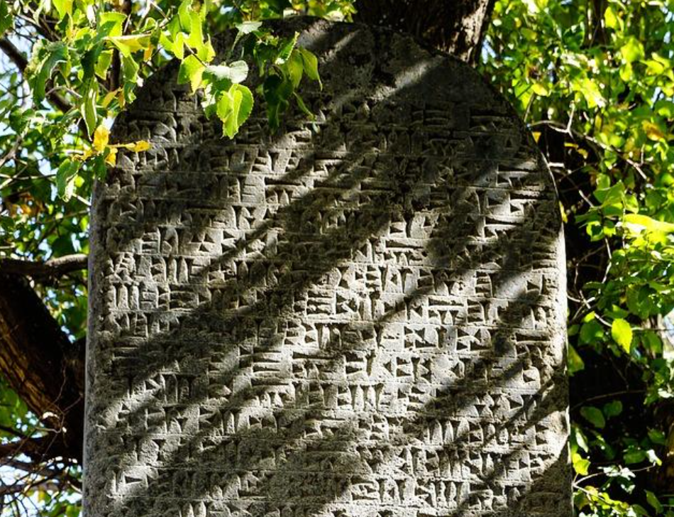
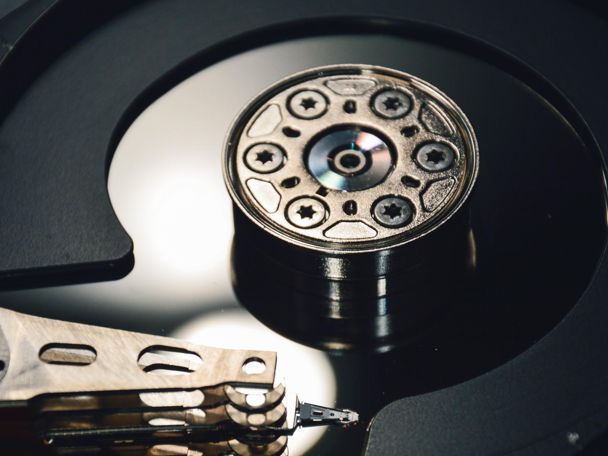
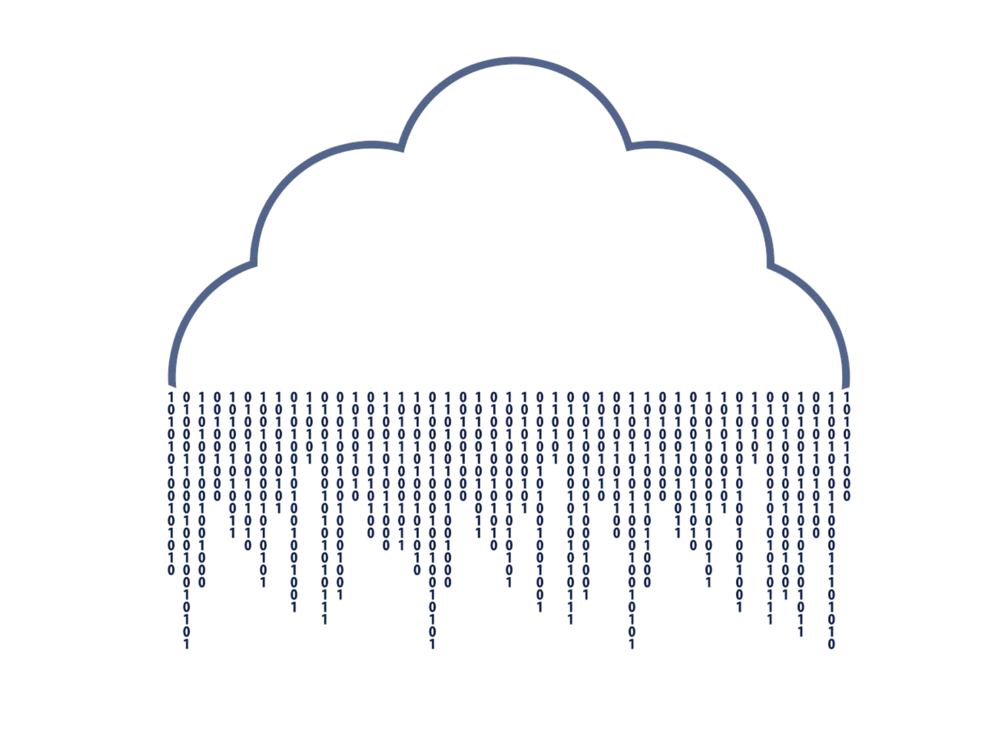

  <h1>FUNDAMENTOS DE BASES DE DATOS</h1>

Este repositorio contiene apuntes del curso de [Fundamentos de Base de Datos](https://platzi.com/clases/bd/ "Fundamentos de Base de Datos") de PLATZI 💚. El curso es dictado por [Israel Vázquez](https://platzi.com/p/isravazquezmorales/ "Israel Vázquez"), Senior Web Developer en SF startup YouNoodle.

Espero estos apuntes puedan servirles de apoyo durante el curso. 

att. D.A.G.B 

Creación del Repositorio: 05/01/2021

Ultima actualización: 05/01/2021

  

&nbsp;

     

## TABLA DE CONTENIDOS
- [CONCEPTOS BÁSICOS Y CONTEXTO HISTÓRICO](#CONCEPTOS-BÁSICOS-Y-CONTEXTO-HISTÓRICO)
-

## CONCEPTOS BÁSICOS Y CONTEXTO HISTÓRICO
>En la antiguedad la información era transmitida de boca en boca y esto causaba que aveces sea distorsionada, además parte de la información que poseía una persona se perdía al concluir con su tiempo de vida. Así las antiguas civilizaciones se dieron cuenta que era necesario almacenar la información. Una de las primeras sistemas de escritura primitivos es el sistema sumerio, que se tallaba en piedra y en arcilla. 

 

 
  
  <h5>Escritura cuneiforme de los sumerios </h5>

 

>Como puede suponerse transportar estas tablillas era en suma complicado y muchas veces algunas terminaban por romperse. Es en este punto donde se da un salto a otro tipo de almacenamiento de informacion como fue papiro y el pergamino. Eran mucho mas portatiles y ligeros pero al estar basados en material vegetal o animal se descomponian con facilidad. 

 

 
  
  <h5>Papiros y pergaminos</h5>

 

>Fue entocnes cuando los chinos revolucionaron el mundo con la creación del papel, el cual era muy portatel y medianamente resistente a la degradación. Sin embargo el proximo gran salto en la revolucion del almacenamiento de datos se da en el siglo 20 con el microfilm un sistema de archivo, gestión y difusión documental. Su gran ventaja era que podia almacenar datos de manera virtualmente infinita, pero su desventaja era poder leer y/o modificar su información que requiere de máquinas especializadas de difícil adquisición.

 

 
  
  <h5>Microfilms</h5>

 

>Posteriormente los medios digitales representaron un gran avance en el almacenamiento de información. Que lograba almacenar la inforamación en formatos de 1 y 0.

 

 
  
  <h5>Medios digitales</h5>

 

>Luego de ello el avance de metodos de almacenamiento de información experimentaría un periodo de recesión hasta la llegada de la nube. La nube trajo consigo una gran ventaja de accesibilidad. Tu puedes acceder a la nube desde cualquier parte del mundo. Además es un medio que puede ser utilizado por varias personas al mismo tiempo.

 

 
  
  <h5>La mitica nube</h5>

 

