

  <h1>FUNDAMENTOS DE BASES DE DATOS</h1>

Este repositorio contiene apuntes del curso de [Fundamentos de Base de Datos](https://platzi.com/clases/bd/ "Fundamentos de Base de Datos") de PLATZI 💚. El curso es dictado por [Israel Vázquez](https://platzi.com/p/isravazquezmorales/ "Israel Vázquez"), Senior Web Developer en SF startup YouNoodle.

Espero estos apuntes puedan servirles de apoyo durante el curso. 

att. D.A.G.B 

Creación del Repositorio: 05/01/2021

Ultima actualización: 07/01/2021

  

&nbsp;

     

## TABLA DE CONTENIDOS
- [CONCEPTOS BÁSICOS Y CONTEXTO HISTÓRICO](#CONCEPTOS-BÁSICOS-Y-CONTEXTO-HISTÓRICO)
  - [Historia del almacenamiento de la información](#Historia-del-almacenamiento-de-la-información)
  - [Surgimiento de las bases de datos](#Surgimiento-de-las-bases-de-datos)
- [INTRODUCCIÓN A LAS BASES DE DATOS RELACIONALES](#INTRODUCCIÓN-A-LAS-BASES-DE-DATOS-RELACIONALES)
  - [Historia de las RDB](#Historia-de-las-RDB)
  - [Entidades y atributos](#Entidades-y-atributos)
  - [Entidades del Platziblog](#Entidades-del-Platziblog)
  - [Relaciones](#Relaciones)
    - [Tipos de cardinalidad](#Tipos-de-cardinalidad)
    - [Cardinalidad muchos a muchos](#Cardinalidad-muchos-a-muchos)

## CONCEPTOS BÁSICOS Y CONTEXTO HISTÓRICO

### Historia del almacenamiento de la información

>En la antiguedad la información era transmitida de boca en boca y esto causaba que aveces sea distorsionada, además parte de la información que poseía una persona se perdía al concluir con su tiempo de vida. Así las antiguas civilizaciones se dieron cuenta que era necesario almacenar la información. Una de las primeras sistemas de escritura primitivos es el sistema sumerio, que se tallaba en piedra y en arcilla. 

 

 
  
  <h5>Escritura cuneiforme de los sumerios </h5>

 

>Como puede suponerse transportar estas tablillas era en suma complicado y muchas veces algunas terminaban por romperse. Es en este punto donde se da un salto a otro tipo de almacenamiento de informacion como fue papiro y el pergamino. Eran mucho mas portatiles y ligeros pero al estar basados en material vegetal o animal se descomponian con facilidad. 

 

 
  
  <h5>Papiros y pergaminos</h5>

 

>Fue entocnes cuando los chinos revolucionaron el mundo con la creación del papel, el cual era muy portatel y medianamente resistente a la degradación. Sin embargo el proximo gran salto en la revolucion del almacenamiento de datos se da en el siglo 20 con el microfilm un sistema de archivo, gestión y difusión documental. Su gran ventaja era que podia almacenar datos de manera virtualmente infinita, pero su desventaja era poder leer y/o modificar su información que requiere de máquinas especializadas de difícil adquisición.

 

 
  
  <h5>Microfilms</h5>

 

>Posteriormente los medios digitales representaron un gran avance en el almacenamiento de información. Que lograba almacenar la inforamación en formatos de 1 y 0.

 

 
  
  <h5>Medios digitales</h5>

 

>Luego de ello el avance de metodos de almacenamiento de información experimentaría un periodo de recesión hasta la llegada de la nube. La nube trajo consigo una gran ventaja de accesibilidad. Tu puedes acceder a la nube desde cualquier parte del mundo. Además es un medio que puede ser utilizado por varias personas al mismo tiempo.

 

 
  
  <h5>La mitica nube</h5>

 

### Surgimiento de las bases de datos

> La bases de datos surgen en la transición a los medios digitales y posteriormente evolucionaría para su uso conjunto con la nube. Las bases de datos como tal son un conjunto de datos almacenados sistemáticamente que mediante programas y servidores facilitan su administración, gestión y uso.  
> Tradicionalmente se reconocen 2 tipos de bases de Datos: 
> -Relacionales: En la industria hay varias compañías dedicadas a ser manejadoras de bases de datos relacionales como SQL Server, Oracle, MariaDB, entre otras. 
> -No relacionales: Todavía están avanzando y existen ejemplos muy distintos como cassandra, elasticsearch, neo4j, MongoDB, entre otras. 

 

 
  
  <h5>SQL vs noSQL</h5>

 

> Sin embargo tambie podemos clasificar ciertas bases de datos de acuerdos al tipo de sus servicios:  
> -Auto administrados: Es la base de datos que instalas tú y te encargas de actualizaciones, mantenimiento, etc.  
> -Administrados: Servicios que ofrecen las nubes modernas como Azure y no debes preocuparte por mantenimiento o actualizaciones.  

# INTRODUCCIÓN A LAS BASES DE DATOS RELACIONALES

## Historia de las RDB

> Las bases de datos surgen de la necesidad de conservar la información más allá de lo que existe en la memoria RAM. El modelo de von Neumann o arquitectura Princeton, es una arquitectura de computadoras que constaba de una unidad de procesamiento, una unidad de control, una memoria y mecanismos de entrada y salida  

> Sin embargo la memoria del modelo de von Neuman solo se utilizaba para almacenar tanto datos como instrucciones (lo que hoy sería el equivalente a la RAM), mas no contemplaba el guardado de datos persistentes. En este punto se empezaron a buscar formas de como guardar estos datos. Así surgen primero las bases de datos basadas en archivos eran datos guardados en texto plano, fáciles de guardar pero muy difíciles de consultar.

 

 
  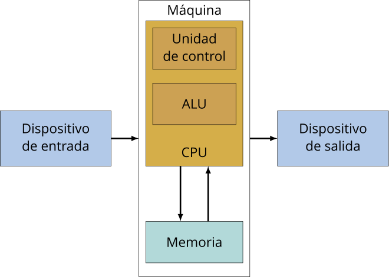
  <h5>Modelo de von Neuman</h5>

 

> Ante la necesidad de mejorar esto nacen las bases de datos relacionales. Su inventor Edgar Codd dejó ciertas reglas para asegurarse de que toda la filosofía de las bases de datos no se perdiera (LAS 12 REGLAS DE CODD), estandarizando de este modo el el proceso, estó a raiz de que en 1990 Codd mismo se preocupó al ver que ciertos sistemas de gestión de bases de datos (SGBD) que decían ser relacionales, no lo eran. Además de ello Codd invento el ALGEBRA RELACIONAL. 

Reglas  | Descripción
------------- | -------------
Regla 0: Regla de fundación. | Cualquier sistema que se proclame como relacional, debe ser capaz de gestionar sus bases de datos enteramente mediante sus capacidades relacionales.
Regla 1: Regla de la información. | a) Todos los datos deben estar almacenados en las tablas.   b) Esas tablas deben cumplir las premisas del modelo relacional.  c) No puede haber información a la que accedemos por otra vía.
Regla 2: Regla del acceso garantizado. | a) Cualquier dato es accesible sabiendo la clave de su fila y el nombre de su columna o atributo.  b) Si a un dato no podemos acceder de esta forma, no estamos usando un modelo relacional.
Regla 3: Regla del tratamiento sistemático de valores nulos. | a) Esos valores pueden dar significado a la columna que los contiene.   b) El SGBD debe tener la capacidad de manejar valores nulos.   c) El SGBD reconocerá este valor diferenciándolo de cualquier otro.   d) El SGBD deberá aplicársele la lógica apropiada.   e) Es un valor independiente del tipo de datos de la columna.
Regla 4: Catálogo dinámico en línea basado en el modelo relacional. | a) El catálogo en línea es el diccionario de datos.   b) El diccionario de datos se debe de poder consultar usando las mismas técnicas que para los datos.   c) Los metadatos, por tanto, se organizan también en tablas relacionales.   d) Si SELECT es una instrucción que consulta datos, también será la que consulta los metadatos.
Regla 5: Regla comprensiva del sublenguaje de los datos completo. | a) Al menos tiene que existir un lenguaje capaz de hacer todas las funciones del SGBD.   b) No puede haber funciones fuera de ese lenguaje.   c) Puede haber otros lenguajes en el SGBD para hacer ciertas tareas.   d) Pero esas tareas también se deben poder hacer con el “lenguaje completo”.
Regla 6: Regla de actualización de vistas. | a) Las vistas tienen que mostrar información actualizada.   b) No puede haber diferencias entre los datos de las vistas y los datos de las tablas base.
Regla 7: Alto nivel de inserción, actualización, y cancelación. | a) La idea es que el lenguaje que maneja la base de datos sea muy humano.   b) Eso implica que las operaciones del lenguaje de manipulación de los datos (DML) trabajen con conjuntos de filas a la vez.   c) Para modificar, eliminar o añadir datos, no hará falta programar de la forma en la que lo hacen los lenguajes de tercera generación como C o Java.
Regla 8: Independencia física de los datos. | a) Cambios en la física de la BD no afecta a las aplicaciones ni a los esquemas lógicos.   b) El acceso a las tablas (elemento lógico) no cambia porque la física de la base de datos cambie.
Regla 9: Independencias lógicas de los datos. | a) Cambios en el esquema lógico (tablas) de la BD no afectan al resto de esquemas.   b) Si cambiamos nombres de tabla, o de columna o modificamos información de las filas, las aplicaciones (esquema externo) no se ven afectadas.   c) Es más difícil de conseguir.
Regla 10: Independencia de la integridad. | a) Las reglas de integridad (restricciones) deben de ser gestionadas y almacenadas por el SGBD.
Regla 11: Independencia de la distribución. | a) Que la base de datos se almacene o gestione de forma distribuida en varios servidores, no afecta al uso de esta ni a la programación de las aplicaciones de usuario.   b) El esquema lógico es el mismo independientemente de si la BD es distribuida o no.
Regla 12: La regla de la no subversión. | a) La base de datos no permitirá que exista un lenguaje o forma de acceso, que permita saltarse las reglas anteriores.

## Entidades y atributos

>Entidad: Es algo similar a un objeto (revisar progrmación orientada a objetos), la diferencia con estos últimos, es que una entidad solo se refiere a los datos, en cambio un objeto se refiere a datos y los métodos (o funciones) como tal que controlan estos datos. En bases de datos, una entidad es cuando abstraemos un objeto de la vida real. Al igual que los obejtos las entidades poseen atributos ligados a si, que son las cosas que los hacen ser una entidad. Por convención se diagraman dentro de cuadrados y por además se ponen en plural.

 

 
  
  <h5>Entidad "laptops"</h5>

 

>Atributos: Son las características que podemos proporcionarles a una entidad, y que por convención se representan con ovalos. Existen ciertos atributos especiales a los que se les desgina de forma particular:

ATRIBUTOS  | Descripción
------------- | -------------
Multivaluado | Puede poseer multiples valores (ejemplo: 4 valores diferentes par el atributo "llantas" de la entidad "automóviles").
Compuestos | Los cuales están compuestos por otros atributos (ejemplo: para la entidad "laptos" el atributo "metodos de entrada " esta compuesto por el atributo "trackpad" y "teclado"). 
Especiales (almacenados y derivados)| Que puedes representarse con líneas punteadas (ejemplo: antiguedad o edad de una persona, se puede primero determinar en la misma base de datos la fecha de nacimiento y cuando la edad sea desfasada, se actualiza automáticamente a partir de su fecha de nacimiento.)

 

 
  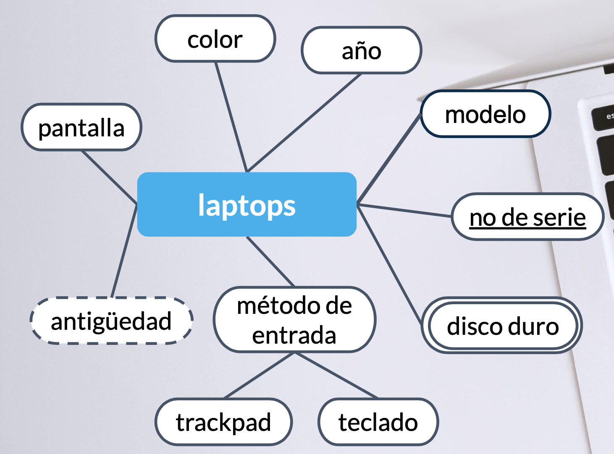
  <h5>Atributos de la entidad "laptops"</h5>

 

> Pero quizá los atributos mas importantes,sean los denominados los ATRIBUTOS LLAVES son aquellos que identifican a la entidad y no pueden ser repetidos. Se representan con un subrayado. Existen principalemnte 2:  
> -Naturales: son inherentes al objeto como el número de serie.  
> -Clave artificial: no es inherente al objeto y se asigna de manera arbitraria.

 

 
  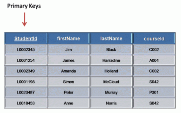
  <h5>Atributo llave "Student id"</h5>

 

> Finalmente debemos conocer que las entidades pueden ser  
> -Entidades fuertes: Son entidades que pueden sobrevivir por si solo. Al leer la tabla sabes que son las entidades (se encierra en un recuadro).  
> -Entidades débiles: No puede existir sin una entidad fuerte. Al leer la tabla no puedes saber que son las entidades (se encierra en un recuadro doble). En esto podemos diferenciar 2 subtipos: las **Identidades Débiles por Identidad** (no se diferencian entre sí más que por la clave de su identidad fuerte) y las **Identidades Débiles por Existencia** (que se les asigna una clave propia, pero su existencia sigue siendo dependiente de una fuerte).

 

 
  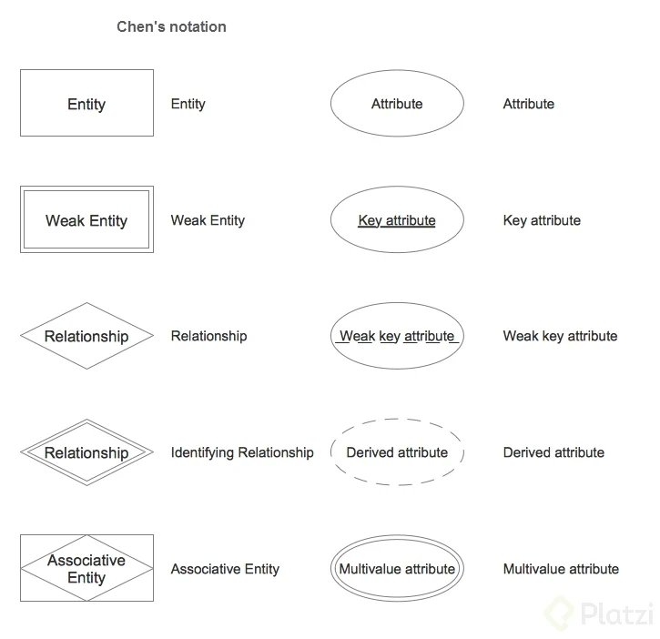
  <h5>Resumen representativo de entidades y atributos</h5>

 

## Entidades del Platziblog

> Durante el curso desarrollares un proyecto completo de inicio a fin basandonos en un Platziblog. Este proyecto nos presenta un contexto familiar y nos representará retos muy interesantes.  
> -Primer paso: Identificar las entidades.
 

 
  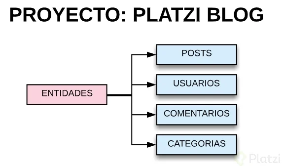
  <h5>Las Entidades del Platziblog</h5>

 

> Segundo paso: Pensar en los atributos.
 

 
  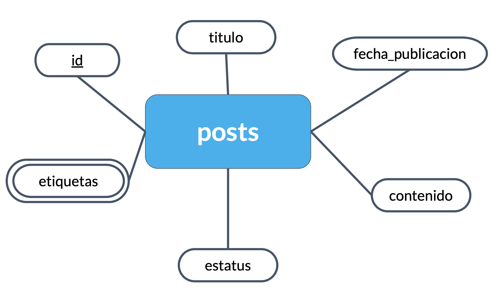
  <h5> Atributos de entidad "Posts"</h5>

 

 
  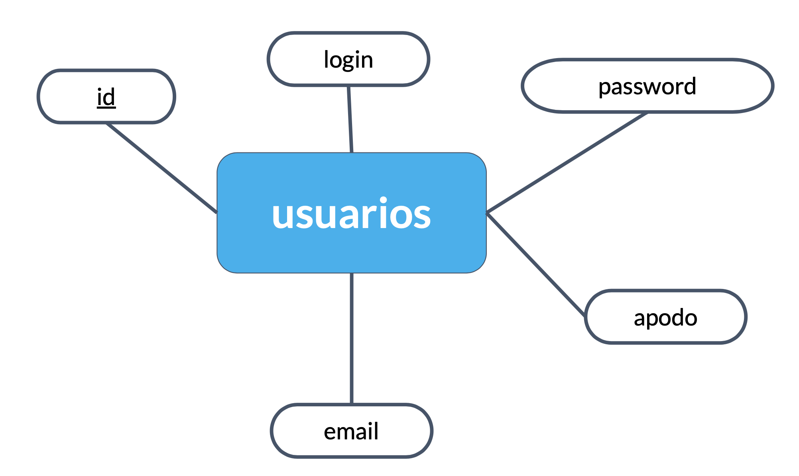
  <h5> Atributos de entidad "Usuarios"</h5>

 

> Una recomendación importante que es que no utilicemos el correo del usuario como id. Es mejor generar un id independiente para cada usuario puesto que a pesar de que email es único, limitará la identificación cuando el usuario quiera cambiar su email.

## Relaciones

> Las relaciones, clasifcamente son representadas por un rombo. Sirven para poder ligar o unir nuestras diferentes entidades. Por convención las relaciones son verbos que conectan entidades.  
> *NOTA:Los atributos multivaluados (ejm. discos duros),pueden relacionarse de diversas formas con el resto de entidades. Por ello, se suele convertilos a entidad separadas, a este proceso de se le denomina "normalizar" (se explicará luego).*

 

 
  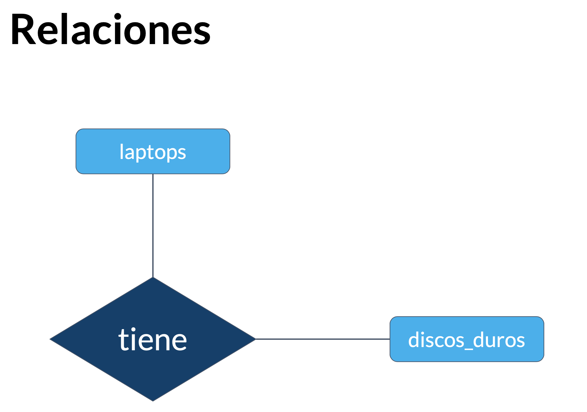
  <h5> Atributos de entidad "Usuarios"</h5>

 

> Y para comprender mejor cuántos de un lado pertenecen a cuántos del otro lado, surge el concepto de **CARDINALIDAD**. La cual es una propiedad de las relaciones que indica la cantidad y correspondencia con la que puede estar relacionada una entidad. 

### Tipos de cardinalidad

TIPOS DE CARDINALIDAD | Descripción
------------- | -------------
Uno-Uno (1:1) | Significa que cada entidad de la primera relación se va a relacionar con una entidad de la segunda relación y viceversa.
Cero-Uno (0:1) | Esta cardinalidad aveces se debate, y se sugiere denominarlo de 1 a 1 opcional. Con esto nos referimos a que puede existir la opción de que no exista uno de los datos. 
Cero-Muchos (0:N) | Esta cardinalidad igualmente se debate, y se sugiere denominarlo de 1 a N opcional. Con esto nos referimos a que puede existir la opción de que no exista uno de los datos. 
Una-Muchas (1:N) | Las entidades de la relación r1 se pueden relacionar con varias entidades de la relación r2. Pero las entidades de la relación r2 solo pueden asociarse con una entidad de r1. 
Muchas-Una (N:1) | Las entidades de r1 solo pueden asociarse con una entidad de r2. Mientras que las entidades de r2 pueden asociarse con varias entidades contenidas en r1.
Muchas-Muchas (N:N) | Las entidades de ambas relaciones pueden asociarse con varias entidades de la contraria.

 

 
  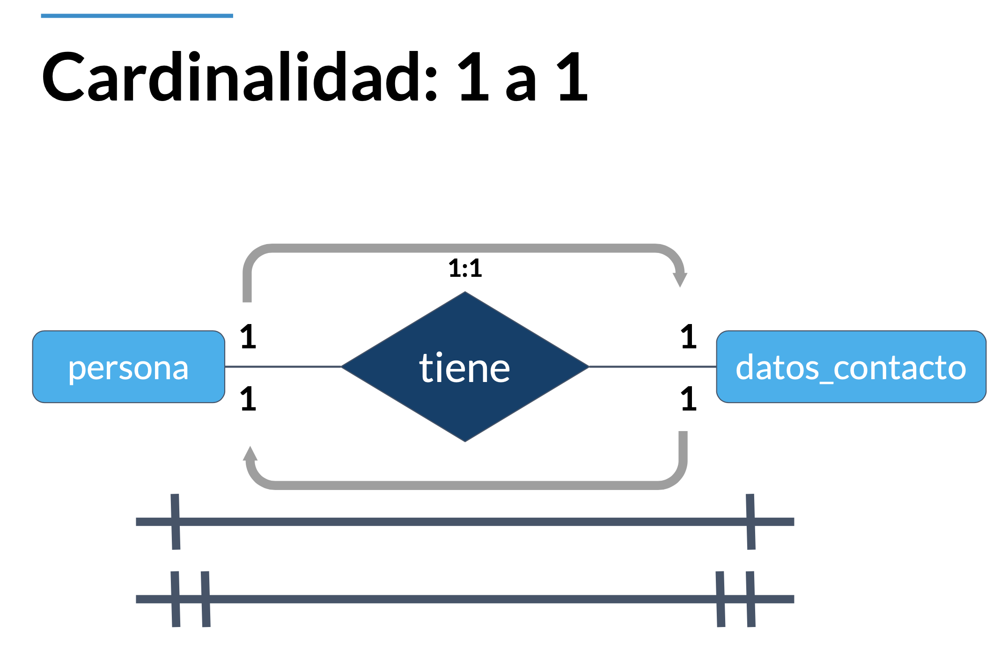
  <h5> Cardinalidad 1:1 </h5>

 

 
  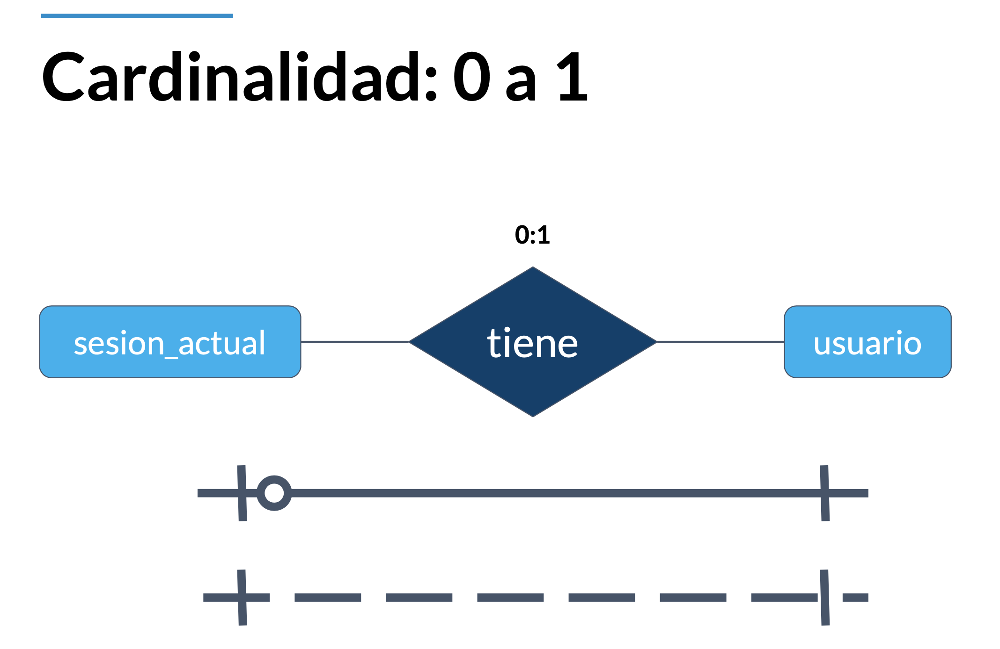
  <h5> Cardinalidad 0:1 </h5>

 

 

 
  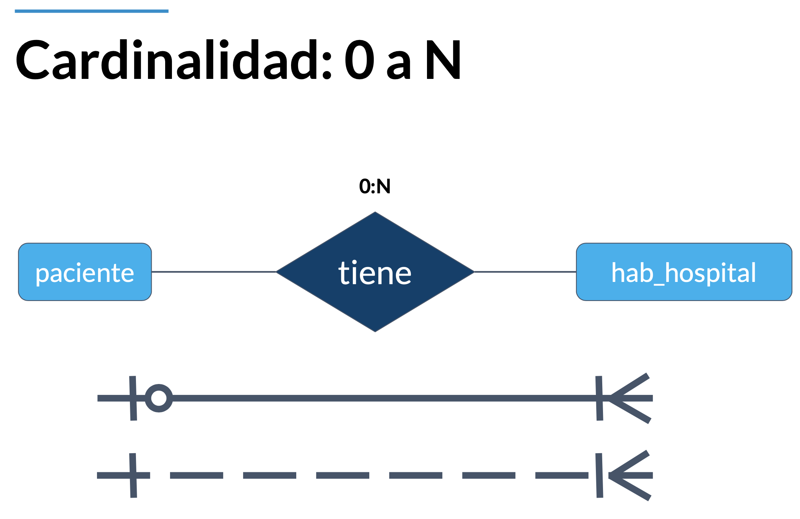
  <h5> Cardinalidad 0:N </h5>

 

 
  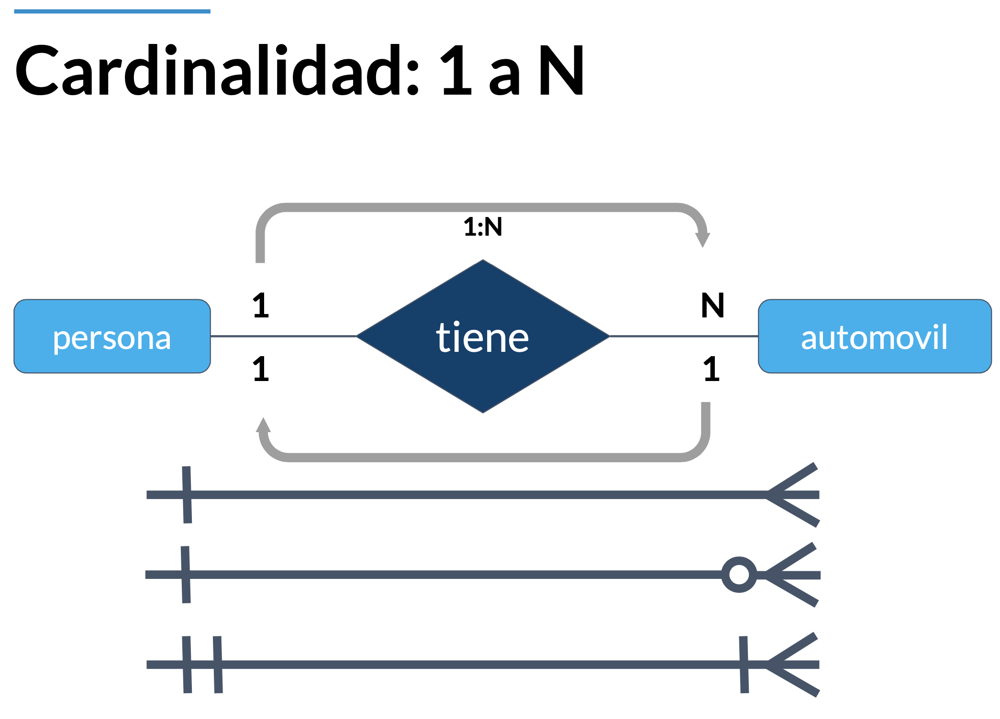
  <h5> Cardinalidad 1:N </h5>

### Cardinalidad muchos a muchos

> La cardinalidad muchos a muchos es una de las cardinalidades mas especiales y que mas retos deberemos ir resolviendo a lo largo del desarrollo de una base de datos. *(Nota: En la representación grafica, se puede añidir una barra verticar a cada lado que simboliza que la relación es estricta, osea que SIEMPRE hay muchos a un lado y muchos al otro. Pero se usa para casos muy particulares).*

 

 
  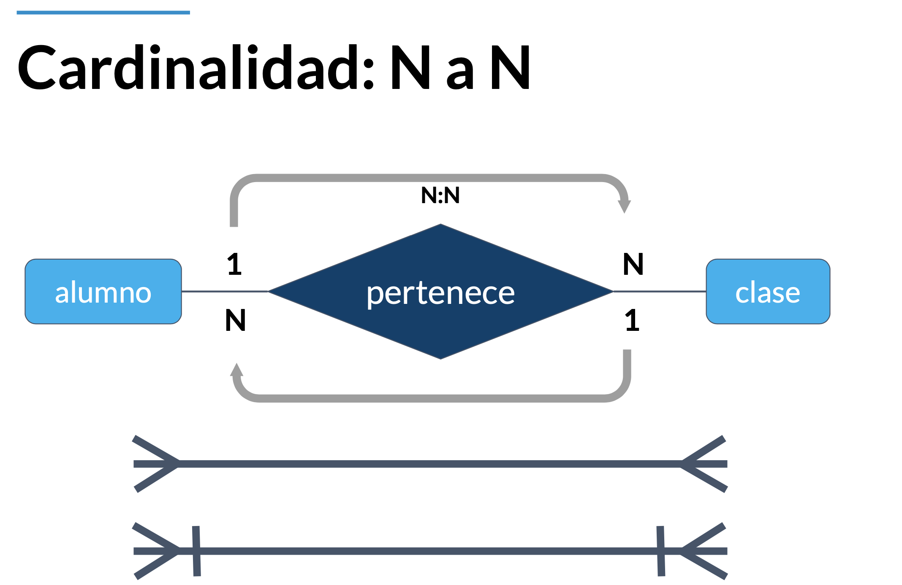
  <h5> Cardinalidad N:N </h5>

