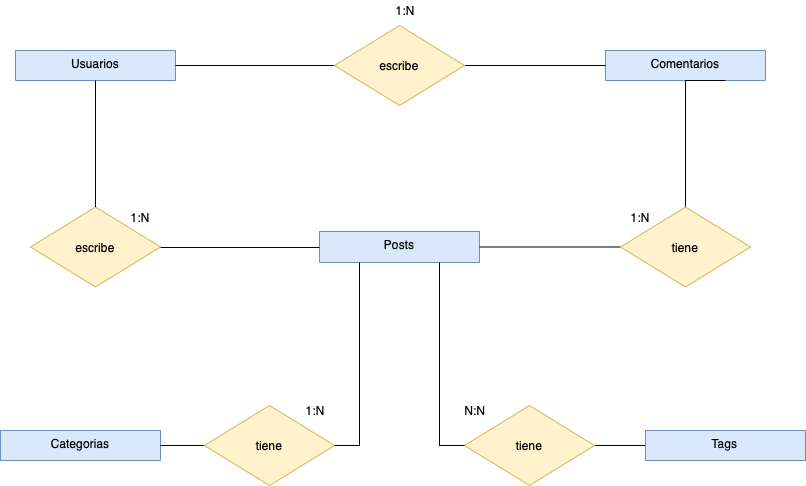

  <h1>FUNDAMENTOS DE BASES DE DATOS</h1>

Este repositorio contiene apuntes del curso de [Fundamentos de Base de Datos](https://platzi.com/clases/bd/ "Fundamentos de Base de Datos") de PLATZI 💚. El curso es dictado por [Israel Vázquez](https://platzi.com/p/isravazquezmorales/ "Israel Vázquez"), Senior Web Developer en SF startup YouNoodle.

Espero estos apuntes puedan servirles de apoyo durante el curso. 

att. D.A.G.B 

Creación del Repositorio: 05/01/2021

Ultima actualización: 09/01/2021

  

&nbsp;

     

## TABLA DE CONTENIDOS
- [CONCEPTOS BÁSICOS Y CONTEXTO HISTÓRICO](#CONCEPTOS-BÁSICOS-Y-CONTEXTO-HISTÓRICO)
  - [Historia del almacenamiento de la información](#Historia-del-almacenamiento-de-la-información)
  - [Surgimiento de las bases de datos](#Surgimiento-de-las-bases-de-datos)
- [INTRODUCCIÓN A LAS BASES DE DATOS RELACIONALES](#INTRODUCCIÓN-A-LAS-BASES-DE-DATOS-RELACIONALES)
  - [Historia de las RDB](#Historia-de-las-RDB)
  - [Entidades y atributos](#Entidades-y-atributos)
  - [Entidades del Platziblog](#Entidades-del-Platziblog)
  - [Relaciones](#Relaciones)
    - [Tipos de cardinalidad](#Tipos-de-cardinalidad)
    - [Cardinalidad muchos a muchos](#Cardinalidad-muchos-a-muchos)
  - [Diagrama ER](#Diagrama-ER)
  - [Tipos de datos y constraints](#Tipos-de-datos-y-constraints)
    - [Datos de texto](#Datos-de-texto)
    - [Datos numéricos](#Datos-numéricos)
    - [Datos de fecha y hora](#Datos-de-fecha-y-hora)
    - [Datos lógicos](#Datos-lógicos)
    - [Los constraints](#Los-constraints)
  - [La Normalización](#La-Normalización)
    - [Normalizacion de Platziblog](#Normalizacion-de-Platziblog)
- [RDBMS (MySQL)](#RDBMS-(MySQL))
  - [RDB ¿Qué?](#RDB-¿Qué?)
  - [Clientes gráficos](#Clientes-gráficos)
  - [Servicios administrados](#Servicios-administrados)
- [SQL hasta en la sopa](#SQL-hasta-en-la-sopa)
  - [Historia del SQL](#Historia-del-SQL)
  - [Create view y DDL alter](#Create-view-y-DDL-alter)
  - [DDL drop](#DDL-drop)
  - [DML](#DML)
  - [DCL Y TCL](#DCL-Y-TCL)
  - [¿Que es standar en SQL?](#¿Que-es-standar-en-SQL?)
  - [Creando Tablas](#Creando-tablas)
    - [Tablas independientes](#Tablas-independientes)
    - [Tablas dependientes](#Tablas-dependientes)
    - [Tablas transitivas](#Tablas-transitivas)
- [Consultas a una base de datos](#Consultas-a-una-base-de-datos)
  - [¿Por qué las consultas son tan importantes?](#¿Por-qué-las-consultas-son-tan-importantes?)
  - [Estructura básica de un Query](#Estructura-básica-de-un-Query)
    - [SELECT](#SELECT)
    - [FROM](#FROM)
    - [Utilizando la sentencia FROM](#Utilizando-la-sentencia-FROM)
    - [WHERE](#WHERE)
    - [Utilizando la sentencia WHERE nulo y no nulo](#Utilizando-la-sentencia-WHERE-nulo-y-no-nulo)
    - [GROUP BY](#GROUP-BY)
    - [ORDER BY y HAVING](#ORDER-BY-y-HAVING)
  - [El interminable agujero de conejo (Nested queries)](#El-interminable-agujero-de-conejo-(Nested-queries))
  - [¿Cómo convertir una pregunta en un query SQL?](#¿Cómo-convertir-una-pregunta-en-un-query-SQL?)
  - [Preguntándole a la base de datos](#Preguntándole-a-la-base-de-datos)
  - [Consultando PlatziBlog](#Consultando-PlatziBlog)

## CONCEPTOS BÁSICOS Y CONTEXTO HISTÓRICO

### Historia del almacenamiento de la información

>En la antiguedad la información era transmitida de boca en boca y esto causaba que aveces sea distorsionada, además parte de la información que poseía una persona se perdía al concluir con su tiempo de vida. Así las antiguas civilizaciones se dieron cuenta que era necesario almacenar la información. Una de las primeras sistemas de escritura primitivos es el sistema sumerio, que se tallaba en piedra y en arcilla. 

 

 
  
  <h5>Escritura cuneiforme de los sumerios </h5>

 

>Como puede suponerse transportar estas tablillas era en suma complicado y muchas veces algunas terminaban por romperse. Es en este punto donde se da un salto a otro tipo de almacenamiento de informacion como fue papiro y el pergamino. Eran mucho mas portatiles y ligeros pero al estar basados en material vegetal o animal se descomponian con facilidad. 

 

 
  
  <h5>Papiros y pergaminos</h5>

 

>Fue entocnes cuando los chinos revolucionaron el mundo con la creación del papel, el cual era muy portatel y medianamente resistente a la degradación. Sin embargo el proximo gran salto en la revolucion del almacenamiento de datos se da en el siglo 20 con el microfilm un sistema de archivo, gestión y difusión documental. Su gran ventaja era que podia almacenar datos de manera virtualmente infinita, pero su desventaja era poder leer y/o modificar su información que requiere de máquinas especializadas de difícil adquisición.

 

 
  
  <h5>Microfilms</h5>

 

>Posteriormente los medios digitales representaron un gran avance en el almacenamiento de información. Que lograba almacenar la inforamación en formatos de 1 y 0.

 

 
  
  <h5>Medios digitales</h5>

 

>Luego de ello el avance de metodos de almacenamiento de información experimentaría un periodo de recesión hasta la llegada de la nube. La nube trajo consigo una gran ventaja de accesibilidad. Tu puedes acceder a la nube desde cualquier parte del mundo. Además es un medio que puede ser utilizado por varias personas al mismo tiempo.

 

 
  
  <h5>La mitica nube</h5>

 

### Surgimiento de las bases de datos

> La bases de datos surgen en la transición a los medios digitales y posteriormente evolucionaría para su uso conjunto con la nube. Las bases de datos como tal son un conjunto de datos almacenados sistemáticamente que mediante programas y servidores facilitan su administración, gestión y uso.  
> Tradicionalmente se reconocen 2 tipos de bases de Datos: 
> -Relacionales: En la industria hay varias compañías dedicadas a ser manejadoras de bases de datos relacionales como SQL Server, Oracle, MariaDB, entre otras. 
> -No relacionales: Todavía están avanzando y existen ejemplos muy distintos como cassandra, elasticsearch, neo4j, MongoDB, entre otras. 

 

 
  
  <h5>SQL vs noSQL</h5>

 

> Sin embargo tambie podemos clasificar ciertas bases de datos de acuerdos al tipo de sus servicios:  
> -Auto administrados: Es la base de datos que instalas tú y te encargas de actualizaciones, mantenimiento, etc.  
> -Administrados: Servicios que ofrecen las nubes modernas como Azure y no debes preocuparte por mantenimiento o actualizaciones.  

# INTRODUCCIÓN A LAS BASES DE DATOS RELACIONALES

## Historia de las RDB

> Las bases de datos surgen de la necesidad de conservar la información más allá de lo que existe en la memoria RAM. El modelo de von Neumann o arquitectura Princeton, es una arquitectura de computadoras que constaba de una unidad de procesamiento, una unidad de control, una memoria y mecanismos de entrada y salida  

> Sin embargo la memoria del modelo de von Neuman solo se utilizaba para almacenar tanto datos como instrucciones (lo que hoy sería el equivalente a la RAM), mas no contemplaba el guardado de datos persistentes. En este punto se empezaron a buscar formas de como guardar estos datos. Así surgen primero las bases de datos basadas en archivos eran datos guardados en texto plano, fáciles de guardar pero muy difíciles de consultar.

 

 
  
  <h5>Modelo de von Neuman</h5>

 

> Ante la necesidad de mejorar esto nacen las bases de datos relacionales. Su inventor Edgar Codd dejó ciertas reglas para asegurarse de que toda la filosofía de las bases de datos no se perdiera (LAS 12 REGLAS DE CODD), estandarizando de este modo el el proceso, estó a raiz de que en 1990 Codd mismo se preocupó al ver que ciertos sistemas de gestión de bases de datos (SGBD) que decían ser relacionales, no lo eran. Además de ello Codd invento el ALGEBRA RELACIONAL. 

Reglas  | Descripción
------------- | -------------
Regla 0: Regla de fundación. | Cualquier sistema que se proclame como relacional, debe ser capaz de gestionar sus bases de datos enteramente mediante sus capacidades relacionales.
Regla 1: Regla de la información. | a) Todos los datos deben estar almacenados en las tablas.   b) Esas tablas deben cumplir las premisas del modelo relacional.  c) No puede haber información a la que accedemos por otra vía.
Regla 2: Regla del acceso garantizado. | a) Cualquier dato es accesible sabiendo la clave de su fila y el nombre de su columna o atributo.  b) Si a un dato no podemos acceder de esta forma, no estamos usando un modelo relacional.
Regla 3: Regla del tratamiento sistemático de valores nulos. | a) Esos valores pueden dar significado a la columna que los contiene.   b) El SGBD debe tener la capacidad de manejar valores nulos.   c) El SGBD reconocerá este valor diferenciándolo de cualquier otro.   d) El SGBD deberá aplicársele la lógica apropiada.   e) Es un valor independiente del tipo de datos de la columna.
Regla 4: Catálogo dinámico en línea basado en el modelo relacional. | a) El catálogo en línea es el diccionario de datos.   b) El diccionario de datos se debe de poder consultar usando las mismas técnicas que para los datos.   c) Los metadatos, por tanto, se organizan también en tablas relacionales.   d) Si SELECT es una instrucción que consulta datos, también será la que consulta los metadatos.
Regla 5: Regla comprensiva del sublenguaje de los datos completo. | a) Al menos tiene que existir un lenguaje capaz de hacer todas las funciones del SGBD.   b) No puede haber funciones fuera de ese lenguaje.   c) Puede haber otros lenguajes en el SGBD para hacer ciertas tareas.   d) Pero esas tareas también se deben poder hacer con el “lenguaje completo”.
Regla 6: Regla de actualización de vistas. | a) Las vistas tienen que mostrar información actualizada.   b) No puede haber diferencias entre los datos de las vistas y los datos de las tablas base.
Regla 7: Alto nivel de inserción, actualización, y cancelación. | a) La idea es que el lenguaje que maneja la base de datos sea muy humano.   b) Eso implica que las operaciones del lenguaje de manipulación de los datos (DML) trabajen con conjuntos de filas a la vez.   c) Para modificar, eliminar o añadir datos, no hará falta programar de la forma en la que lo hacen los lenguajes de tercera generación como C o Java.
Regla 8: Independencia física de los datos. | a) Cambios en la física de la BD no afecta a las aplicaciones ni a los esquemas lógicos.   b) El acceso a las tablas (elemento lógico) no cambia porque la física de la base de datos cambie.
Regla 9: Independencias lógicas de los datos. | a) Cambios en el esquema lógico (tablas) de la BD no afectan al resto de esquemas.   b) Si cambiamos nombres de tabla, o de columna o modificamos información de las filas, las aplicaciones (esquema externo) no se ven afectadas.   c) Es más difícil de conseguir.
Regla 10: Independencia de la integridad. | a) Las reglas de integridad (restricciones) deben de ser gestionadas y almacenadas por el SGBD.
Regla 11: Independencia de la distribución. | a) Que la base de datos se almacene o gestione de forma distribuida en varios servidores, no afecta al uso de esta ni a la programación de las aplicaciones de usuario.   b) El esquema lógico es el mismo independientemente de si la BD es distribuida o no.
Regla 12: La regla de la no subversión. | a) La base de datos no permitirá que exista un lenguaje o forma de acceso, que permita saltarse las reglas anteriores.

## Entidades y atributos

>Entidad: Es algo similar a un objeto (revisar progrmación orientada a objetos), la diferencia con estos últimos, es que una entidad solo se refiere a los datos, en cambio un objeto se refiere a datos y los métodos (o funciones) como tal que controlan estos datos. En bases de datos, una entidad es cuando abstraemos un objeto de la vida real. Al igual que los obejtos las entidades poseen atributos ligados a si, que son las cosas que los hacen ser una entidad. Por convención se diagraman dentro de cuadrados y por además se ponen en plural.

 

 
  
  <h5>Entidad "laptops"</h5>

 

>Atributos: Son las características que podemos proporcionarles a una entidad, y que por convención se representan con ovalos. Existen ciertos atributos especiales a los que se les desgina de forma particular:

ATRIBUTOS  | Descripción
------------- | -------------
Multivaluado | Puede poseer multiples valores (ejemplo: 4 valores diferentes par el atributo "llantas" de la entidad "automóviles").
Compuestos | Los cuales están compuestos por otros atributos (ejemplo: para la entidad "laptos" el atributo "metodos de entrada " esta compuesto por el atributo "trackpad" y "teclado"). 
Especiales (almacenados y derivados)| Que puedes representarse con líneas punteadas (ejemplo: antiguedad o edad de una persona, se puede primero determinar en la misma base de datos la fecha de nacimiento y cuando la edad sea desfasada, se actualiza automáticamente a partir de su fecha de nacimiento.)

 

 
  
  <h5>Atributos de la entidad "laptops"</h5>

 

> Pero quizá los atributos mas importantes,sean los denominados los ATRIBUTOS LLAVES son aquellos que identifican a la entidad y no pueden ser repetidos. Se representan con un subrayado. Existen principalemnte 2:  
> -Naturales: son inherentes al objeto como el número de serie.  
> -Clave artificial: no es inherente al objeto y se asigna de manera arbitraria.

 

 
  
  <h5>Atributo llave "Student id"</h5>

 

> Finalmente debemos conocer que las entidades pueden ser  
> -Entidades fuertes: Son entidades que pueden sobrevivir por si solo. Al leer la tabla sabes que son las entidades (se encierra en un recuadro).  
> -Entidades débiles: No puede existir sin una entidad fuerte. Al leer la tabla no puedes saber que son las entidades (se encierra en un recuadro doble). En esto podemos diferenciar 2 subtipos: las **Identidades Débiles por Identidad** (no se diferencian entre sí más que por la clave de su identidad fuerte) y las **Identidades Débiles por Existencia** (que se les asigna una clave propia, pero su existencia sigue siendo dependiente de una fuerte).

 

 
  
  <h5>Resumen representativo de entidades y atributos</h5>

 

## Entidades del Platziblog

> Durante el curso desarrollares un proyecto completo de inicio a fin basandonos en un Platziblog. Este proyecto nos presenta un contexto familiar y nos representará retos muy interesantes.  
> -Primer paso: Identificar las entidades.
 

 
  
  <h5>Las Entidades del Platziblog</h5>

 

> Segundo paso: Pensar en los atributos.
 

 
  
  <h5> Atributos de entidad "Posts"</h5>

 

 
  
  <h5> Atributos de entidad "Usuarios"</h5>

 

> Una recomendación importante que es que no utilicemos el correo del usuario como id. Es mejor generar un id independiente para cada usuario puesto que a pesar de que email es único, limitará la identificación cuando el usuario quiera cambiar su email.

## Relaciones

> Las relaciones, clasifcamente son representadas por un rombo. Sirven para poder ligar o unir nuestras diferentes entidades. Por convención las relaciones son verbos que conectan entidades.  
> *NOTA:Los atributos multivaluados (ejm. discos duros),pueden relacionarse de diversas formas con el resto de entidades. Por ello, se suele convertilos a entidad separadas, a este proceso de se le denomina "normalizar" (se explicará luego).*

 

 
  
  <h5> Atributos de entidad "Usuarios"</h5>

 

> Y para comprender mejor cuántos de un lado pertenecen a cuántos del otro lado, surge el concepto de **CARDINALIDAD**. La cual es una propiedad de las relaciones que indica la cantidad y correspondencia con la que puede estar relacionada una entidad. 

### Tipos de cardinalidad

TIPOS DE CARDINALIDAD | Descripción
------------- | -------------
Uno-Uno (1:1) | Significa que cada entidad de la primera relación se va a relacionar con una entidad de la segunda relación y viceversa.
Cero-Uno (0:1) | Esta cardinalidad aveces se debate, y se sugiere denominarlo de 1 a 1 opcional. Con esto nos referimos a que puede existir la opción de que no exista uno de los datos. 
Cero-Muchos (0:N) | Esta cardinalidad igualmente se debate, y se sugiere denominarlo de 1 a N opcional. Con esto nos referimos a que puede existir la opción de que no exista uno de los datos. 
Una-Muchas (1:N) | Las entidades de la relación r1 se pueden relacionar con varias entidades de la relación r2. Pero las entidades de la relación r2 solo pueden asociarse con una entidad de r1. 
Muchas-Una (N:1) | Las entidades de r1 solo pueden asociarse con una entidad de r2. Mientras que las entidades de r2 pueden asociarse con varias entidades contenidas en r1.
Muchas-Muchas (N:N) | Las entidades de ambas relaciones pueden asociarse con varias entidades de la contraria.

 

 
  
  <h5> Cardinalidad 1:1 </h5>

 

 
  
  <h5> Cardinalidad 0:1 </h5>

 

 

 
  
  <h5> Cardinalidad 0:N </h5>

 

 
  
  <h5> Cardinalidad 1:N </h5>

### Cardinalidad muchos a muchos

> La cardinalidad muchos a muchos es una de las cardinalidades mas especiales y que mas retos deberemos ir resolviendo a lo largo del desarrollo de una base de datos. *(Nota: En la representación grafica, se puede añidir una barra verticar a cada lado que simboliza que la relación es estricta, osea que SIEMPRE hay muchos a un lado y muchos al otro. Pero se usa para casos muy particulares).*

 

 
  
  <h5> Cardinalidad N:N </h5>

## Diagrama ER

> Un diagrama Entidad-Relación es como un mapa y nos ayuda a entender cuáles son las entidades con las que vamos a trabajar, cuáles son sus relaciones y qué papel van a jugar en las aplicaciones de la base de datos.  

> *Nota:Una página muy util para elaborar estos diagramas es [DIAGRAMS](https://app.diagrams.net)*

 

 
  
  <h5> Diagrama E:R de Platziblog </h5>

> Debemos recordar que existen varios métodos para representar una misma relación. A estos diversos metodos se les conoce como: **Diagramming Convention Techniques**

 

 
  
  <h5> Diagramming Convention Techniques </h5>

### Tipos de datos y constraints

Para llevar a la práctica un diagrama debemos ir más allá y darle detalle con parámetros, convirtiendo nuestro Diagrama ER en un Diagrama Físico, pero para poder desarrollarlo primero debemos comprende 2 conceptos: **los tipos de datos** y **los constraints**

#### Datos de texto

Datos tipo texto | Descripción
------------- | -------------
Char(n) | Permite almacenar caracteres y cadenas de texto. Este tipo de dato reserva un espacio de memoria del número de caracteres que va a ser ocupado.
Varchar(n) | Al igual que char, este reserva espacio en la memoria. Su diferencia radica en que este reserva un mínimo espacio de memoria, y a partir de esta va creciendo o encogiéndose, es eficiente cuando desconocés cual será el tamaño de tu cadena de texto (Su limite es de 255 caracteres).
Text | Su función es guardar cadenas de texto que sean muy grandes.

#### Datos numéricos

Datos numéricos | Descripción
------------- | -------------
Integer | Número que no tiene punto decimal, se usa para declarar un tipo de dato entero que puede ser usado para hacer operaciones. Al usar este tipo de dato nuestra base de datos sabrá que estamos hablando de número y no solo de un simple carácter.
Bigint | Subtipo de integer, nos sirve para declarar números muy grandes.
Smallint | Subtipo de integer, nos para declarar números muy pequeños (99 o menos).
Decimal (n, s) y Numeric (n, s) | Tienen dos parámetros (n y s, en este ejemplo). La primera entrada es para números enteros, y la segunda entrada es para números decimales. Nos sirve para hacer operaciones mas precisas.

#### Datos de fecha y hora
> Esta clase de tipos de datos es muy peculiar ya que nos ayuda internamente a tener una bitácora de nuestra base de datos.

Datos de fecha y hora | Descripción
------------- | -------------
Date | Solo contiene la fecha (año, mes y día).
Time | Solo contiene la hora.
Datetime | Es una mezcla de los dos primeros, contiene fecha y hora.
Timestamp | Es el número de segundos que ha transcurrido desde que tu archivo fue creado. En otras palabras, podría decirse que es un medidor de tiempo.

#### Datos lógicos

Datos lógicos | Descripción
------------- | -------------
Booleano | Este solo puede tener dos valores, funciona como un tipo de dato binario. Es usado de manera discriminatoria para hacer validaciones.

 

 
  
  <h5> Tipos de datos </h5>

#### Los constraints
> Por su lado los contraints o restricciones son los tipos de reglas que vas a permitir que tenga tu base de datos. Y son:

Constraints | Descripción
------------- | -------------
Not null | Se asegura que tu columna no tenga valores nulos.
Unique | Asegura que cada valor en tu columna no se repita. (ejemplo: el email)
Primary Key o Llave primaria | Es una etiqueta muy importante, es una combinación entre not null y unique. **Es el constraint que nos permite hacer relaciones entre distintas entidades.**
Foreign Key o Llave foránea | Es el otro lado de una primary key, cuando queremos juntar dos tablas y decir que estan relacionadas entre si, lo que va a suceder es la primary key de una de las tablas se añadirá como foreign key de la otra.
Check | Algunas bases de datos removieron este tipo de contraints, pero las que lo conservan son muy potentes. Tiene la función de permitir que añadamos las reglas que queramos a nuestra base de datos.
Default | Coloca un valor por defecto cuando no hay un valor especificado.
Index | Se crea por columna, su función es hacer búsquedas con mayor rapidez. Su única desventaja es que suele volverse lenta cada vez que se añaden nuevos registros. (No recomendada en tablas donde escribimos muchos nuevos registros)

 

 
  
  <h5> Los constraints </h5>

### La Normalización

> El proceso de normalización es un estándar que consiste, básicamente, en un proceso de conversión de las relaciones entre las entidades. Es útil para separar la información, minimizar la redundancia de los datos, para que la actualización de los datos sea más sencilla y la integridad de los datos se conserve. Esto obedece a las 12 reglas de Codd y nos permiten separar componentes en la base de datos. Identificamos para ello 4 reglas denominadas **Formas normales**.

Formas normales | Descripción
------------- | -------------
Primera forma normal (1FN) | **Atributos atómicos (Sin campos repetidos)**   Para un atributo sólo debe existir una columna, si surge la necesidad, no se debe crear otra columna (Esto porque si crees que con n columnas es suficiente, tarde que temprano necesitarás n+1) Sencillamente se añade un identificador y posteriormente se divide por filas.
Segunda forma normal (2FN) | **Cumple 1FN y cada campo de la tabla debe depender de una clave única.**   Esto nos ayuda a tener datos más organizados, y distinguir entre si un atributo hace parte de una entidad, o si son dos entidades separadas relacionadas estrechamente.
Tercera forma normal (3FN) | **Cumple 1FN, 2FN y los campos que no son clave no deben tener dependencias.**   Sí un dato de un atributo esta directamente relacionado con otro, para que al editar un dato, no deba editar otro campo y haya espacio a errores (porque alguno “se me olvidó”), se separa en una tabla diferente de esta manera la actualización de los datos es más limpia.
Cuarta forma normal (4FN) | **Cumple 1FN, 2FN, 3FN y los campos multivaluados se identifican por una clave única.**   Esta es usualmente útil cuándo se tiene una cardinalidad N:M, de muchos a muchos, y simplemente se crea una tabla especial para relacionar las claves únicas de las entidades.

 

 
  
  <h5> Tabla sin normalizar </h5>

  
  <h5> 1FN </h5>

  
  <h5> 2FN </h5>

  
  <h5> 3FN </h5>

  
  <h5> 4FN </h5>

> Al normalizar evitanmos:  
> -La redundancia de los datos: repetición de datos en un sistema.  
> -Anomalías de actualización: Inconsistencias de los datos como resultado de datos redundantes y actualizaciones parciales.  
> -Anomalías de borrado: Pérdidas no intencionadas de datos debido a que se han borrado otros datos.  
> -Anomalías de inserción: Imposibilidad de adicionar datos en la base de datos debido a la ausencia de otros datos.

#### Normalizacion de Platziblog

> Ahora aplicaremos la normalización a nuestro proyecto de Platziblog

 

 
  
  <h5> Diagrama Platziblog </h5>

> *NOTA 01: Al normalizar aunque parezca que la información se multiplicó, en realidad la descompusimos de manera que a un sistema le sea fácil de reconocer y mantener la consistencia de los datos.*  
> *NOTA 02: Algunos autores precisan una 5FN que hace referencia a que después de realizar esta normalización a través de uniones (JOIN) permita regresar a la data original de la cual partió.*

## RDBMS (MySQL)

### RDB ¿Qué?

> RDBMS significa Relational Database Management System o sistema manejador de bases de datos relacionales. Es un programa que se encarga de seguir las reglas de Codd y se puede utilizar de manera programática. Actúa como sistema que permite crear, editar y administrar una base de datos relacional. En su gran mayoría usan el Lenguaje de Consultas Estructuradas (SQL).

 

 
  
  <h5> Los constraints </h5>

### Clientes gráficos

> Los clientes graficos son herramientas gráficas que nos ayudan a representar y ver el funcionamiento de una base de datos internamente.Como parte de las herramientas que vienen en Mysql viene ya instalado, un cliente grafico llamado MySQL Workbench, una aplicación creada por los propios desarrolladores de MySQL. Se trata de una herramienta visual muy completa que, además, es multiplataforma y se puede instalar en sistemas Windows, Linux y Mac.  

> Sin embargo eisten otras opciones como: dbeaver, HeidiSql, Navicat, Wamp, Xamp, DataGrip, Sequel Pro, PhpMyAdmin, etc.

 

 
  
  <h5> MySQL Workbench </h5>

 

 
  
  <h5> Creando una base de datos desde el cliente gráfico </h5>

### Servicios administrados

>Hoy en día muchas empresas ya no tienen instalados en sus servidores los RDBMS sino que los contratan a otras personas. Estos servicios administrados cloud te permiten concentrarte en la base de datos y no en su administración y actualización. Algunos muy famosos son AWS(de Amazon), GCP (Google Cloud Platform) o Azure (Microsoft).

 

 
  
  <h5> DB services en AWS </h5>

## SQL hasta en la sopa

### Historia del SQL
>Debido a la necesidad de la época por realizar consultas de datos de una forma más organizada se crea SQL como una especie de lenguaje estándar para hacer este proceso en los distintos manejadores de datos.  

> Asi suge SQL (Structured Query Language), el cual es un lenguaje de dominio específico utilizado en programación, diseñado para administrar, y recuperar información de sistemas de gestión de bases de datos relacionales. Su objetivo es hacer un solo lenguaje para consultar cualquier manejador de bases de datos volviéndose un gran estándar. SQL es un estándar aceptado por ANSI (Instituto Nacional Estadounidense de Estándares).

 

 
  
  <h5> SQL </h5>

> Ahora existe el NOSQL (Not Only Structured Query Language) que significa que no sólo se utiliza SQL en las bases de datos no relacionales. Pero siguen usando SQL como base pero no es exclusivo.

 

 
  
  <h5> SQL vs noSQL </h5>

> *NOTA1: Un **lenguaje de dominio específico** es como un lenguaje de programación pero dedicado a resolver un problema en particular. Por lo tanto SQL, al igual que HTML o CSS, no es un lenguaje de programación como tal, pero es un lenguaje que nos permite estructurar datos, asi como HTML es un lenguaje de marcado de texto y CSS un lenguaje para diseñar interfaces.*  

> *NOTA2: **PL/SQL** es un lenguaje de programación de la base de datos de Oracle, el nombre viene de Procedural Language/Structured Query Language y **T-SQL** es un lenguaje de programación de la base de datos de Microsoft SQL Server y el nombre viene de TRANSACT-SQL*

> Es improtante comprender que dentro del SQL como lenguaje de domio específico podemos hallar grandes sublenguajes:

 

 
  
  <h5> Sublenguajes </h5>

> **1. DDL (Data Definition Language)**: Permite crear y modificar la estructura de una base de datos. Posee los siguientes comandos:

Comandos | Descripción
------------- | -------------
CREATE | Utilizado para crear nuevas tablas, campos e índices.
ALTER | Utilizado para modificar las tablas agregando campos o cambiando la definición de los campos.
DROP | Empleado para eliminar tablas e índices.
TRUNCATE | Empleado para eliminar todos los registros de una tabla.
COMMENT | Utilizado para agregar comentarios al diccionario de datos.
RENAME | Tal como su nombre lo indica es utilizado para renombrar objetos.

> Iniciaremos creando una tabla

    CREATE SCHEMA `platziblog` ;

> Podemos identificar 3 objetos que manipularemos con el lenguaje DDL:  
> -Database o bases de datos.  
> -Table o tablas. Son la traducción a SQL de las entidades.  
> -View o vistas: Se ofrece la proyección de los datos de la base de datos de forma entendible.

### Create view y DDL alter

> Primero vamos a crear la tabla people con sus atributos

    CREATE TABLE `platziblog`.`people` (
        `person_id` INT NOT NULL AUTO_INCREMENT,
        `last_name` VARCHAR(255) NULL,
        `first_name` VARCHAR(255) NULL,
        `address` VARCHAR(255) NULL,
        `city` VARCHAR(255) NULL,
    PRIMARY KEY (`person_id`));

 

 
  
  <h5> Atributos de tabla people </h5>

> Ahora vamos a agregarle datos

    INSERT INTO `platziblog`.`people` (`person_id`, `last_name`, `first_name`, `address`, `city`) 
    VALUES ('1', 'Vásquez', 'Israel', 'Calle Famosa Num 1', 'México'),
	       ('2', 'Hernández', 'Mónica', 'Reforma 222', 'México'),
	       ('3', 'Alanis', 'Edgar', 'Central 1', 'Monterrey');
	       
 

 
  
  <h5> Agregando datos en tabla people </h5>

> Ahora crearemos una vista de dicha tabla

    USE `platziblog`;
    CREATE  OR REPLACE VIEW `new_view` AS
    SELECT * FROM platziblog.people;

> Ahora vamos modificar sus datos, crearemos una columna con ALTER 

    ALTER TABLE `Platziblog`.`people` 
    ADD COLUMN `date_of_birth` DATETIME NULL AFTER `city`;
    
    ALTER TABLE `platziblog`.`people` 
    DROP COLUMN `date_of_birth`;

### DDL drop

> Está puede ser la sentencia ¡más peligrosa. Sobre todo cuando somos principiantes. Básicamente borra o desaparece de nuestra base de datos algún elemento. Podemos borrar desde una tabla hasta toda la base de datos completa:

    DROP TABLE `platziblog`.`people`;
    DROP DATABASE `platziblog`;

### DML

> **2. DML (Data Manipulation Language)**: A diferencia de DDL que esta orientado a la estrucutra de la BD, el DML esta orientado al contenido de la BD. Permite recuperar, almacenar, modificar, eliminar, insertar y actualizar datos de una base de datos. Posee los siguientes comandos:

Comandos | Descripción
------------- | -------------
SELECT | Utilizado para consultar registros de la base de datos que satisfagan un criterio determinado.
INSERT | Utilizado para cargar de datos en la base de datos en una única operación.
UPDATE | Utilizado para modificar los valores de los campos y registros especificados
DELETE | Utilizado para eliminar registros de una tabla de una base de datos.

> Primero intentaremos insertar nuevos datos

    INSERT INTO `platziblog`.`people` (`last_name`, `first_name`, `address`) 
    VALUES ('Hernández', 'Laura', 'Calle 12');

> Ahora cambiaremos algunos datos   
    
    UPDATE `platziblog`.`people` SET `last_name` = 'Chavez', `city` = 'Mérida' WHERE (`person_id` = '1');

> Ahora borraremos contenido de la tabla con DELETE

    DELETE FROM `platziblog`.`people` WHERE (`person_id` = '1');

> Finalmente realizaremos una consulta a nuestra base de datos

    SELECT first_name, last_name FROM people;
    
 

 
  
  <h5> comando select </h5>

### DCL Y TCL
    
> **3. DCL (Data Control Language)**: Permite crear roles, permisos e integridad referencial, así como el control al acceso a la base de datos.

Comandos | Descripción
------------- | -------------
GRANT | Usado para otorgar privilegios de acceso de usuario a la base de datos.
REVOKE | Utilizado para retirar privilegios de acceso otorgados con el comando GRANT.

> **4. TCL (Transactional Control Language)**: Permite administrar diferentes transacciones que ocurren dentro de una base de datos.

Comandos | Descripción
------------- | -------------
COMMIT | Empleado para guardar el trabajo hecho.
ROLLBACK | Utilizado para deshacer la modificación que hice desde el último COMMIT.

### ¿Que es standar en SQL?

> La utilidad más grande de SQL fue unificar la forma en la que pensamos y hacemos preguntas a un repositorio de datos. Ahora que nacen nuevas bases de datos igualmente siguen tomando elementos de SQL. Podemos afirmar que:
> -SQL unificó la manera en que sea hacen preguntas a un repositorio de datos.
> -Se convirtió en un standard util a la hora de usar bases de datos.
> -Existen otros manejadores de datos como Oracle o PostgreSQL. Sin embargo, si escribimos en lenguaje SQL todos los manejadores funcionaran de manera similar.

> Ejemplo: DDL y DML son exactamente las mismas para distintos manejadores de base de datos que tengan el standard SQL, existes algunos cambios sutiles que mas son funcionamiento interno del manejador de DB, por este motivo se puede ejecutar estos scripts por ejemplo en POsgresSQL y en MySQL

    create TABLE people (
	person_id int,
    last_name varchar(255),
    first_name varchar(255),
    address varchar(255),
    city varchar(255)
    );
    INSERT INTO people (last_name, first_name, address, ciyt)
    VALUES ("Hernandez", "Laura", "Calle Rio Blanco", "Macas");

    SELECT first_name, last_name
    FROM people;

### Creando Tablas

#### Tablas independientes

> Ahora empezaremos a plasmar la BD de Platziblog segun nuestro Diagrama Físico. Una buena práctica es comenzar creando las entidades que no tienen una llave foránea. A estas tablas se les denomina, tablas independientes. Generalmente en los nombres de bases de datos se evita usar eñes o acentos para evitar problemas en los manejadores de las bases de datos.

    /*creacion de base de datos PlatziBlog*/
    create database PlatziBlog default character set utf8 ;

    /*linia para utilizar PlatziBlog*/
    use PlatziBlog;

    /*construccion de tablas independientes*/
    create table categorias
    (
    id int not null auto_increment,
    nom_categoria varchar(30) not null,
    constraint primary key (id)
    );

    create table etiquetas
    (
    id int not null auto_increment,
    nom_etiquetas varchar(30) not null,
    constraint primary key (id)
    );

    create table usuarios 
    (
    id int not null auto_increment,
    login varchar(30) not null,
    pasword varchar(32) not null,
    nickname varchar(40) not null,
    email varchar(40) not null,
    primary key (id),
    unique key email_unique (email)
    )

 

 
  
  <h5> T.independientes del platziblog </h5>

#### Tablas dependientes

> Ahora es momento de crear las entidades que si tienen una llave foránea. A estas tablas se les denomina, tablas dependientes.

    ALTER TABLE `PlatziBlog`.`posts` 
    ADD INDEX `usuario_posts_fk_idx` (`usuario_id` ASC) VISIBLE;
    ;
    ALTER TABLE `PlatziBlog`.`posts` 
    ADD CONSTRAINT `usuario_posts_fk`
      FOREIGN KEY (`usuario_id`)
      REFERENCES `PlatziBlog`.`usuarios` (`id`)
      ON DELETE NO ACTION
      ON UPDATE NO ACTION;
  
    ALTER TABLE `PlatziBlog`.`posts` 
    ADD INDEX `categorias_posts_fk_idx` (`categoria_id` ASC) VISIBLE;
    ;
    ALTER TABLE `PlatziBlog`.`posts` 
    ADD CONSTRAINT `categorias_posts_fk`
      FOREIGN KEY (`categoria_id`)
      REFERENCES `PlatziBlog`.`categorias` (`id`)
      ON DELETE NO ACTION
      ON UPDATE NO ACTION;
      
    CREATE TABLE comentarios 
    (
    comentarios_id int not null auto_increment,
    comentario TEXT NOT NULL, 
    usuarios_id INT NOT NULL,
    posts_id INT NOT NULL,
    constraint primary key (comentarios_id)
    )
    ;
    ALTER TABLE `PlatziBlog`.`comentarios` 
    ADD CONSTRAINT `usuarios_comentario_fk`
      FOREIGN KEY (`usuarios_id`)
      REFERENCES `PlatziBlog`.`usuarios` (`id`)
      ON DELETE NO ACTION
      ON UPDATE NO ACTION
    ;
    ALTER TABLE `PlatziBlog`.`comentarios` 
    ADD CONSTRAINT `posts_comentario_fk`
      FOREIGN KEY (`posts_id`)
      REFERENCES `PlatziBlog`.`posts` (`id`)
      ON DELETE NO ACTION
      ON UPDATE NO ACTION
      
 

 
  
  <h5> Añadiendo Foreign key </h5>

> Las Foreing Key options son las siguientes:  
> -On update: Significa qué pasará con las relaciones cuando una de estas sea modificada en sus campos relacionados.  
> -On delete: Significa qué pasará con las relaciones cuando una de estas sea eliminada en sus campos relacionados.

 

 
  
  <h5> Foreing Key options </h5>

Valores | Descripción
------------- | -------------
Cascade | Si un usuario es eliminado/modificado entonces se borrarán/modificaran todos los post relacionados.
Restrict | No se podrá eliminar/modificar un usuario hasta que sean eliminados/modificados todos su post relacionados.
Set null | Si un usuario es eliminado/modificado, entonces los post solo no estará relacionados con NULL.
No action | Si un usuario es eliminado/modificado, no se hará nada. Solo se romperá la relación. 
  
#### Tablas transitivas

> Las tablas transitivas sirven como puente para unir dos tablas. No tienen contenido semántico. Reverse Engineer nos reproduce el esquema del cual nos basamos para crear nuestras tablas. Es útil cuando llegas a un nuevo trabajo y quieres entender cuál fue la mentalidad que tuvieron al momento de crear las bases de datos.

    CREATE TABLE posts_etiquetas
    (
    posts_etiquetas_id int not null auto_increment,
    posts_id INT NOT NULL,
    etiquetas_id INT NOT NULL,
    constraint primary key (posts_etiquetas_id)
        )
    ;
    ALTER TABLE `PlatziBlog`.`posts_etiquetas` 
    ADD CONSTRAINT `posts_etiquetas_posts_fk`
	FOREIGN KEY (`posts_id`)
	REFERENCES `PlatziBlog`.`posts` (`id`)
	ON UPDATE CASCADE
	ON DELETE NO ACTION;
    ;
    ALTER TABLE `PlatziBlog`.`posts_etiquetas` 
    ADD CONSTRAINT `posts_etiquetas_etiquetas_fk`
	FOREIGN KEY (`etiquetas_id`)
	REFERENCES `PlatziBlog`.`etiquetas` (`id`)
	ON UPDATE CASCADE
	ON DELETE NO ACTION
	
 

 
  
  <h5> Diagrama del Reverse Engineer </h5>

## Consultas a una base de datos

> Las consultas o queries a una base de datos son una parte fundamental ya que esto podría salvar un negocio o empresa. Alrededor de las consultas a las bases de datos se han creado varias especialidades como ETL o transformación de datos, business intelligence e incluso machine learning.

Especialidad | Descripción
------------- | -------------
ETL | Correspondería al acrónimo de Extract (Extraer), Transform (Transformar) y Load (Cargar). ETL hace parte del proceso de integración de datos, mas aun es un componente muy importante que completa el resultado final en la relación de aplicaciones y sistemas.
Business intelligence | Extracción y utilización de información de los negocios para tomar decisiones correctas.
Machine learning | procesar datos para encontrar patrones o soluciones nuevas para acelerar el avance de un negocio.

### ¿Por qué las consultas son tan importantes?

> -Las empresas tienen gran necesidad de informacion correcta y oportuna.  
> -Son una parte fundamental al tratar con bases de datos.  
> -Se puede aprender a hacer consultas, mejorando nuestra habilidad en ello a lo largo del tiempo.

### Estructura básica de un Query

> Los queries son la forma en la que estructuramos las preguntas que se harán a la base de datos. Transforma preguntas en sintaxis. Pero al mismo tiempo los query tiene básicamente 2 partes: SELECT y FROM y puede aparecer una tercera como WHERE.  
> *NOTA:La estrellita o asterisco (*) quiere decir que vamos a seleccionar todo sin filtrar campos.*  

Sentencia | Descripción
------------- | -------------
SELECT | que datos queremos obtener (que columnas/campos de la tabla).
FROM | de donde los queremos obtener (de que tabla, por ejemplo).
WHERE | condicion que deben cumplir o filtro que deben pasar los datos a obtener. Es opcional, pero se suele utilizar, ya que sino se obtienen todos los datos sin filtrar ninguno.
GROUP BY | de que manera agrupamos los datos (en este caso agrupa por ciudad).
ORDER BY | de que manera ordenamos los datos (en este caso, por poblacion).
HAVING | otra manera de filtrar los datos.

 

 
  
  <h5> Ejemplo de estructura de un Query </h5>

> Para practicar primero generaremos la base de datos de platziblog.

	CREATE SCHEMA `platziblog` default character SET utf8;

	CREATE TABLE `platziblog`.`categorias`(
		`id` INT NOT NULL auto_increment,
	    `nombre_categoria` varchar(30) NOT NULL,
	primary key (`id`));

	CREATE TABLE `platziblog`.`etiquetas`(
		`id`INT NOT NULL auto_increment,
	    `nombre_etiqueta`varchar(30) NOT NULL,
	primary key (`id`));

	CREATE TABLE `platziblog`.`usuarios`(
		`id` INT NOT NULL auto_increment,
	    `login` varchar(30) NOT NULL,
	    `password` varchar(32) NOT NULL,
	    `nickname` varchar(40) NOT NULL,
	    `email` varchar(40) NOT NULL,
	primary key (`id`),
	UNIQUE INDEX (`email` ASC));

	CREATE TABLE `platziblog`.`posts`(
		`id` INT NOT NULL auto_increment,
	    `titulo` varchar(130) NOT NULL,
	    `fecha_publicacion` timestamp null,
	    `contenido` TEXT NOT NULL,
	    `estatus` char(8) NULL default 'activo',
	    `usuario_id` INT NULL,
		`categoria_id` INT NULL,
	primary key (`id`));

	CREATE TABLE `platziblog`.`comentarios`(
		`id` INT NOT NULL auto_increment,
	    `cuerpo_comentario` TEXT NOT NULL,
	    `usuario_id` INT NOT NULL,
	    `post_id` INT NOT NULL,
	primary key (`id`));

	ALTER TABLE `platziblog`.`posts`
	ADD INDEX `posts_usuarios_idx` (`usuario_id` ASC);
	;
	ALTER TABLE `platziblog`.`posts` 
	ADD constraint `posts_usuarios`
		foreign key (`usuario_id`)
		references `platziblog`.`usuarios` (`id`)
	    ON DELETE NO ACTION
	    ON UPDATE cascade;

	ALTER TABLE `platziblog`.`posts`
	ADD INDEX `posts_categorias_idx` (`categoria_id` ASC);
	;
	ALTER TABLE `platziblog`.`posts` 
	ADD constraint `posts_categorias`
		foreign key (`categoria_id`)
		references `platziblog`.`categorias` (`id`)
	    ON DELETE NO ACTION
	    ON UPDATE no action;

	ALTER TABLE `platziblog`.`comentarios`
	ADD INDEX `comentarios_usuario_idx` (`usuario_id` ASC);
	;
	ALTER TABLE `platziblog`.`comentarios` 
	ADD constraint `comentarios_usuario`
		foreign key (`usuario_id`)
		references `platziblog`.`usuarios` (`id`)
	    ON DELETE NO ACTION
	    ON UPDATE no action;

	ALTER TABLE `platziblog`.`comentarios`
	ADD INDEX `comentarios_post_idx` (`post_id` ASC);
	;
	ALTER TABLE `platziblog`.`comentarios` 
	ADD constraint `comentarios_post`
		foreign key (`post_id`)
		references `platziblog`.`posts` (`id`)
	    ON DELETE NO ACTION
	    ON UPDATE no action;

	CREATE TABLE `platziblog`.`posts_etiquetas`(
		`id` INT NOT NULL auto_increment,
	    `post_id` INT NOT NULL,
		`etiqueta_id` INT NOT NULL,
	primary key (`id`));

	ALTER TABLE `platziblog`.`posts_etiquetas`
	ADD INDEX `postsetiquetas_post_idx` (`post_id` ASC);
	;
	ALTER TABLE `platziblog`.`posts_etiquetas` 
	ADD constraint `postsetiquetas_post`
		foreign key (`post_id`)
		references `platziblog`.`posts` (`id`)
	    ON DELETE NO ACTION
	    ON UPDATE no action;

	ALTER TABLE `platziblog`.`posts_etiquetas`
	ADD INDEX `postsetiquetas_etiquetas_idx` (`etiqueta_id` ASC);
	;
	ALTER TABLE `platziblog`.`posts_etiquetas` 
	ADD constraint `postsetiquetas_etiquetas`
		foreign key (`etiqueta_id`)
		references `platziblog`.`etiquetas` (`id`)
	    ON DELETE NO ACTION
	    ON UPDATE no action;

	USE platziblog;

	-- Datos de prueba

	-- Usuarios
	INSERT INTO `usuarios` (`id`,`login`,`password`,`nickname`,`email`) VALUES (1,'israel','jc8209*(^GCHN_(hcLA','Israel','israel@platziblog.com');
	INSERT INTO `usuarios` (`id`,`login`,`password`,`nickname`,`email`) VALUES (2,'monica','(*&^LKJDHC_(*#YDLKJHODG','Moni','monica@platziblog.com');
	INSERT INTO `usuarios` (`id`,`login`,`password`,`nickname`,`email`) VALUES (3,'laura','LKDJ)_*(-c.M:\"[pOwHDˆå߃∂','Lau','laura@platziblog.com');
	INSERT INTO `usuarios` (`id`,`login`,`password`,`nickname`,`email`) VALUES (4,'edgar','LLiy)CX*Y:M<A<SC_(*N>O','Ed','edgar@platziblog.com');
	INSERT INTO `usuarios` (`id`,`login`,`password`,`nickname`,`email`) VALUES (5,'perezoso','&N_*JS)_Y)*(&TGOKS','Oso Pérez','perezoso@platziblog.com');

	-- Categorías
	INSERT INTO `categorias` (`id`,`nombre_categoria`) VALUES (1,'Ciencia');
	INSERT INTO `categorias` (`id`,`nombre_categoria`) VALUES (2,'Tecnología');
	INSERT INTO `categorias` (`id`,`nombre_categoria`) VALUES (3,'Deportes');
	INSERT INTO `categorias` (`id`,`nombre_categoria`) VALUES (4,'Espectáculos');
	INSERT INTO `categorias` (`id`,`nombre_categoria`) VALUES (5,'Economía');

	-- Etiquetas
	INSERT INTO `etiquetas` (`id`,`nombre_etiqueta`) VALUES (1,'Robótica');
	INSERT INTO `etiquetas` (`id`,`nombre_etiqueta`) VALUES (2,'Computación');
	INSERT INTO `etiquetas` (`id`,`nombre_etiqueta`) VALUES (3,'Teléfonos Móviles');
	INSERT INTO `etiquetas` (`id`,`nombre_etiqueta`) VALUES (4,'Automovilismo');
	INSERT INTO `etiquetas` (`id`,`nombre_etiqueta`) VALUES (5,'Campeonatos');
	INSERT INTO `etiquetas` (`id`,`nombre_etiqueta`) VALUES (6,'Equipos');
	INSERT INTO `etiquetas` (`id`,`nombre_etiqueta`) VALUES (7,'Bolsa de valores');
	INSERT INTO `etiquetas` (`id`,`nombre_etiqueta`) VALUES (8,'Inversiones');
	INSERT INTO `etiquetas` (`id`,`nombre_etiqueta`) VALUES (9,'Brokers');
	INSERT INTO `etiquetas` (`id`,`nombre_etiqueta`) VALUES (10,'Celebridades');
	INSERT INTO `etiquetas` (`id`,`nombre_etiqueta`) VALUES (11,'Eventos');
	INSERT INTO `etiquetas` (`id`,`nombre_etiqueta`) VALUES (12,'Moda');
	INSERT INTO `etiquetas` (`id`,`nombre_etiqueta`) VALUES (13,'Avances');
	INSERT INTO `etiquetas` (`id`,`nombre_etiqueta`) VALUES (14,'Nobel');
	INSERT INTO `etiquetas` (`id`,`nombre_etiqueta`) VALUES (15,'Matemáticas');
	INSERT INTO `etiquetas` (`id`,`nombre_etiqueta`) VALUES (16,'Química');
	INSERT INTO `etiquetas` (`id`,`nombre_etiqueta`) VALUES (17,'Física');
	INSERT INTO `etiquetas` (`id`,`nombre_etiqueta`) VALUES (18,'Largo plazo');
	INSERT INTO `etiquetas` (`id`,`nombre_etiqueta`) VALUES (19,'Bienes Raíces');
	INSERT INTO `etiquetas` (`id`,`nombre_etiqueta`) VALUES (20,'Estilo');

	-- Posts
	INSERT INTO `posts` (`id`,`titulo`,`fecha_publicacion`,`contenido`,`estatus`,`usuario_id`,`categoria_id`) VALUES (43,'Se presenta el nuevo teléfono móvil en evento','2030-04-05 00:00:00','Phasellus laoreet eros nec vestibulum varius. Nunc id efficitur lacus, non imperdiet quam. Aliquam porta, tellus at porta semper, felis velit congue mauris, eu pharetra felis sem vitae tortor. Curabitur bibendum vehicula dolor, nec accumsan tortor ultrices ac. Vivamus nec tristique orci. Nullam fringilla eros magna, vitae imperdiet nisl mattis et. Ut quis malesuada felis. Proin at dictum eros, eget sodales libero. Sed egestas tristique nisi et tempor. Ut cursus sapien eu pellentesque posuere. Etiam eleifend varius cursus.\n\nNullam viverra quam porta orci efficitur imperdiet. Quisque magna erat, dignissim nec velit sit amet, hendrerit mollis mauris. Mauris sapien magna, consectetur et vulputate a, iaculis eget nisi. Nunc est diam, aliquam quis turpis ac, porta mattis neque. Quisque consequat dolor sit amet velit commodo sagittis. Donec commodo pulvinar odio, ut gravida velit pellentesque vitae. Class aptent taciti sociosqu ad litora torquent per conubia nostra, per inceptos himenaeos.\n\nMorbi vulputate ante quis elit pretium, ut blandit felis aliquet. Aenean a massa a leo tristique malesuada. Curabitur posuere, elit sed consectetur blandit, massa mauris tristique ante, in faucibus elit justo quis nisi. Ut viverra est et arcu egestas fringilla. Mauris condimentum, lorem id viverra placerat, libero lacus ultricies est, id volutpat metus sapien non justo. Nulla facilisis, sapien ut vehicula tristique, mauris lectus porta massa, sit amet malesuada dolor justo id lectus. Suspendisse sit amet tempor ligula. Nam sit amet nisl non magna lacinia finibus eget nec augue. Aliquam ornare cursus dapibus. Lorem ipsum dolor sit amet, consectetur adipiscing elit.\n\nDonec ornare sem eget massa pharetra rhoncus. Donec tempor sapien at posuere porttitor. Morbi sodales efficitur felis eu scelerisque. Quisque ultrices nunc ut dignissim vehicula. Donec id imperdiet orci, sed porttitor turpis. Etiam volutpat elit sed justo lobortis, tincidunt imperdiet velit pretium. Ut convallis elit sapien, ac egestas ipsum finibus a. Morbi sed odio et dui tincidunt rhoncus tempor id turpis.\n\nProin fringilla consequat imperdiet. Ut accumsan velit ac augue sollicitudin porta. Phasellus finibus porttitor felis, a feugiat purus tempus vel. Etiam vitae vehicula ex. Praesent ut tellus tellus. Fusce felis nunc, congue ac leo in, elementum vulputate nisi. Duis diam nulla, consequat ac mauris quis, viverra gravida urna.','activo',1,2);
	INSERT INTO `posts` (`id`,`titulo`,`fecha_publicacion`,`contenido`,`estatus`,`usuario_id`,`categoria_id`) VALUES (44,'Tenemos un nuevo auto inteligente','2025-05-04 00:00:00','Phasellus laoreet eros nec vestibulum varius. Nunc id efficitur lacus, non imperdiet quam. Aliquam porta, tellus at porta semper, felis velit congue mauris, eu pharetra felis sem vitae tortor. Curabitur bibendum vehicula dolor, nec accumsan tortor ultrices ac. Vivamus nec tristique orci. Nullam fringilla eros magna, vitae imperdiet nisl mattis et. Ut quis malesuada felis. Proin at dictum eros, eget sodales libero. Sed egestas tristique nisi et tempor. Ut cursus sapien eu pellentesque posuere. Etiam eleifend varius cursus.\n\nNullam viverra quam porta orci efficitur imperdiet. Quisque magna erat, dignissim nec velit sit amet, hendrerit mollis mauris. Mauris sapien magna, consectetur et vulputate a, iaculis eget nisi. Nunc est diam, aliquam quis turpis ac, porta mattis neque. Quisque consequat dolor sit amet velit commodo sagittis. Donec commodo pulvinar odio, ut gravida velit pellentesque vitae. Class aptent taciti sociosqu ad litora torquent per conubia nostra, per inceptos himenaeos.\n\nMorbi vulputate ante quis elit pretium, ut blandit felis aliquet. Aenean a massa a leo tristique malesuada. Curabitur posuere, elit sed consectetur blandit, massa mauris tristique ante, in faucibus elit justo quis nisi. Ut viverra est et arcu egestas fringilla. Mauris condimentum, lorem id viverra placerat, libero lacus ultricies est, id volutpat metus sapien non justo. Nulla facilisis, sapien ut vehicula tristique, mauris lectus porta massa, sit amet malesuada dolor justo id lectus. Suspendisse sit amet tempor ligula. Nam sit amet nisl non magna lacinia finibus eget nec augue. Aliquam ornare cursus dapibus. Lorem ipsum dolor sit amet, consectetur adipiscing elit.\n\nDonec ornare sem eget massa pharetra rhoncus. Donec tempor sapien at posuere porttitor. Morbi sodales efficitur felis eu scelerisque. Quisque ultrices nunc ut dignissim vehicula. Donec id imperdiet orci, sed porttitor turpis. Etiam volutpat elit sed justo lobortis, tincidunt imperdiet velit pretium. Ut convallis elit sapien, ac egestas ipsum finibus a. Morbi sed odio et dui tincidunt rhoncus tempor id turpis.\n\nProin fringilla consequat imperdiet. Ut accumsan velit ac augue sollicitudin porta. Phasellus finibus porttitor felis, a feugiat purus tempus vel. Etiam vitae vehicula ex. Praesent ut tellus tellus. Fusce felis nunc, congue ac leo in, elementum vulputate nisi. Duis diam nulla, consequat ac mauris quis, viverra gravida urna.','activo',2,2);
	INSERT INTO `posts` (`id`,`titulo`,`fecha_publicacion`,`contenido`,`estatus`,`usuario_id`,`categoria_id`) VALUES (45,'Ganador del premio Nobel por trabajo en genética','2023-12-22 00:00:00','Phasellus laoreet eros nec vestibulum varius. Nunc id efficitur lacus, non imperdiet quam. Aliquam porta, tellus at porta semper, felis velit congue mauris, eu pharetra felis sem vitae tortor. Curabitur bibendum vehicula dolor, nec accumsan tortor ultrices ac. Vivamus nec tristique orci. Nullam fringilla eros magna, vitae imperdiet nisl mattis et. Ut quis malesuada felis. Proin at dictum eros, eget sodales libero. Sed egestas tristique nisi et tempor. Ut cursus sapien eu pellentesque posuere. Etiam eleifend varius cursus.\n\nNullam viverra quam porta orci efficitur imperdiet. Quisque magna erat, dignissim nec velit sit amet, hendrerit mollis mauris. Mauris sapien magna, consectetur et vulputate a, iaculis eget nisi. Nunc est diam, aliquam quis turpis ac, porta mattis neque. Quisque consequat dolor sit amet velit commodo sagittis. Donec commodo pulvinar odio, ut gravida velit pellentesque vitae. Class aptent taciti sociosqu ad litora torquent per conubia nostra, per inceptos himenaeos.\n\nMorbi vulputate ante quis elit pretium, ut blandit felis aliquet. Aenean a massa a leo tristique malesuada. Curabitur posuere, elit sed consectetur blandit, massa mauris tristique ante, in faucibus elit justo quis nisi. Ut viverra est et arcu egestas fringilla. Mauris condimentum, lorem id viverra placerat, libero lacus ultricies est, id volutpat metus sapien non justo. Nulla facilisis, sapien ut vehicula tristique, mauris lectus porta massa, sit amet malesuada dolor justo id lectus. Suspendisse sit amet tempor ligula. Nam sit amet nisl non magna lacinia finibus eget nec augue. Aliquam ornare cursus dapibus. Lorem ipsum dolor sit amet, consectetur adipiscing elit.\n\nDonec ornare sem eget massa pharetra rhoncus. Donec tempor sapien at posuere porttitor. Morbi sodales efficitur felis eu scelerisque. Quisque ultrices nunc ut dignissim vehicula. Donec id imperdiet orci, sed porttitor turpis. Etiam volutpat elit sed justo lobortis, tincidunt imperdiet velit pretium. Ut convallis elit sapien, ac egestas ipsum finibus a. Morbi sed odio et dui tincidunt rhoncus tempor id turpis.\n\nProin fringilla consequat imperdiet. Ut accumsan velit ac augue sollicitudin porta. Phasellus finibus porttitor felis, a feugiat purus tempus vel. Etiam vitae vehicula ex. Praesent ut tellus tellus. Fusce felis nunc, congue ac leo in, elementum vulputate nisi. Duis diam nulla, consequat ac mauris quis, viverra gravida urna.','activo',3,1);
	INSERT INTO `posts` (`id`,`titulo`,`fecha_publicacion`,`contenido`,`estatus`,`usuario_id`,`categoria_id`) VALUES (46,'Los mejores vestidos en la alfombra roja','2021-12-22 00:00:00','Phasellus laoreet eros nec vestibulum varius. Nunc id efficitur lacus, non imperdiet quam. Aliquam porta, tellus at porta semper, felis velit congue mauris, eu pharetra felis sem vitae tortor. Curabitur bibendum vehicula dolor, nec accumsan tortor ultrices ac. Vivamus nec tristique orci. Nullam fringilla eros magna, vitae imperdiet nisl mattis et. Ut quis malesuada felis. Proin at dictum eros, eget sodales libero. Sed egestas tristique nisi et tempor. Ut cursus sapien eu pellentesque posuere. Etiam eleifend varius cursus.\n\nNullam viverra quam porta orci efficitur imperdiet. Quisque magna erat, dignissim nec velit sit amet, hendrerit mollis mauris. Mauris sapien magna, consectetur et vulputate a, iaculis eget nisi. Nunc est diam, aliquam quis turpis ac, porta mattis neque. Quisque consequat dolor sit amet velit commodo sagittis. Donec commodo pulvinar odio, ut gravida velit pellentesque vitae. Class aptent taciti sociosqu ad litora torquent per conubia nostra, per inceptos himenaeos.\n\nMorbi vulputate ante quis elit pretium, ut blandit felis aliquet. Aenean a massa a leo tristique malesuada. Curabitur posuere, elit sed consectetur blandit, massa mauris tristique ante, in faucibus elit justo quis nisi. Ut viverra est et arcu egestas fringilla. Mauris condimentum, lorem id viverra placerat, libero lacus ultricies est, id volutpat metus sapien non justo. Nulla facilisis, sapien ut vehicula tristique, mauris lectus porta massa, sit amet malesuada dolor justo id lectus. Suspendisse sit amet tempor ligula. Nam sit amet nisl non magna lacinia finibus eget nec augue. Aliquam ornare cursus dapibus. Lorem ipsum dolor sit amet, consectetur adipiscing elit.\n\nDonec ornare sem eget massa pharetra rhoncus. Donec tempor sapien at posuere porttitor. Morbi sodales efficitur felis eu scelerisque. Quisque ultrices nunc ut dignissim vehicula. Donec id imperdiet orci, sed porttitor turpis. Etiam volutpat elit sed justo lobortis, tincidunt imperdiet velit pretium. Ut convallis elit sapien, ac egestas ipsum finibus a. Morbi sed odio et dui tincidunt rhoncus tempor id turpis.\n\nProin fringilla consequat imperdiet. Ut accumsan velit ac augue sollicitudin porta. Phasellus finibus porttitor felis, a feugiat purus tempus vel. Etiam vitae vehicula ex. Praesent ut tellus tellus. Fusce felis nunc, congue ac leo in, elementum vulputate nisi. Duis diam nulla, consequat ac mauris quis, viverra gravida urna.','activo',4,4);
	INSERT INTO `posts` (`id`,`titulo`,`fecha_publicacion`,`contenido`,`estatus`,`usuario_id`,`categoria_id`) VALUES (47,'Los paparatzi captan escándalo en cámara','2025-01-09 00:00:00','Phasellus laoreet eros nec vestibulum varius. Nunc id efficitur lacus, non imperdiet quam. Aliquam porta, tellus at porta semper, felis velit congue mauris, eu pharetra felis sem vitae tortor. Curabitur bibendum vehicula dolor, nec accumsan tortor ultrices ac. Vivamus nec tristique orci. Nullam fringilla eros magna, vitae imperdiet nisl mattis et. Ut quis malesuada felis. Proin at dictum eros, eget sodales libero. Sed egestas tristique nisi et tempor. Ut cursus sapien eu pellentesque posuere. Etiam eleifend varius cursus.\n\nNullam viverra quam porta orci efficitur imperdiet. Quisque magna erat, dignissim nec velit sit amet, hendrerit mollis mauris. Mauris sapien magna, consectetur et vulputate a, iaculis eget nisi. Nunc est diam, aliquam quis turpis ac, porta mattis neque. Quisque consequat dolor sit amet velit commodo sagittis. Donec commodo pulvinar odio, ut gravida velit pellentesque vitae. Class aptent taciti sociosqu ad litora torquent per conubia nostra, per inceptos himenaeos.\n\nMorbi vulputate ante quis elit pretium, ut blandit felis aliquet. Aenean a massa a leo tristique malesuada. Curabitur posuere, elit sed consectetur blandit, massa mauris tristique ante, in faucibus elit justo quis nisi. Ut viverra est et arcu egestas fringilla. Mauris condimentum, lorem id viverra placerat, libero lacus ultricies est, id volutpat metus sapien non justo. Nulla facilisis, sapien ut vehicula tristique, mauris lectus porta massa, sit amet malesuada dolor justo id lectus. Suspendisse sit amet tempor ligula. Nam sit amet nisl non magna lacinia finibus eget nec augue. Aliquam ornare cursus dapibus. Lorem ipsum dolor sit amet, consectetur adipiscing elit.\n\nDonec ornare sem eget massa pharetra rhoncus. Donec tempor sapien at posuere porttitor. Morbi sodales efficitur felis eu scelerisque. Quisque ultrices nunc ut dignissim vehicula. Donec id imperdiet orci, sed porttitor turpis. Etiam volutpat elit sed justo lobortis, tincidunt imperdiet velit pretium. Ut convallis elit sapien, ac egestas ipsum finibus a. Morbi sed odio et dui tincidunt rhoncus tempor id turpis.\n\nProin fringilla consequat imperdiet. Ut accumsan velit ac augue sollicitudin porta. Phasellus finibus porttitor felis, a feugiat purus tempus vel. Etiam vitae vehicula ex. Praesent ut tellus tellus. Fusce felis nunc, congue ac leo in, elementum vulputate nisi. Duis diam nulla, consequat ac mauris quis, viverra gravida urna.','inactivo',4,4);
	INSERT INTO `posts` (`id`,`titulo`,`fecha_publicacion`,`contenido`,`estatus`,`usuario_id`,`categoria_id`) VALUES (48,'Se mejora la conducción autónoma de vehículos','2022-05-23 00:00:00','Phasellus laoreet eros nec vestibulum varius. Nunc id efficitur lacus, non imperdiet quam. Aliquam porta, tellus at porta semper, felis velit congue mauris, eu pharetra felis sem vitae tortor. Curabitur bibendum vehicula dolor, nec accumsan tortor ultrices ac. Vivamus nec tristique orci. Nullam fringilla eros magna, vitae imperdiet nisl mattis et. Ut quis malesuada felis. Proin at dictum eros, eget sodales libero. Sed egestas tristique nisi et tempor. Ut cursus sapien eu pellentesque posuere. Etiam eleifend varius cursus.\n\nNullam viverra quam porta orci efficitur imperdiet. Quisque magna erat, dignissim nec velit sit amet, hendrerit mollis mauris. Mauris sapien magna, consectetur et vulputate a, iaculis eget nisi. Nunc est diam, aliquam quis turpis ac, porta mattis neque. Quisque consequat dolor sit amet velit commodo sagittis. Donec commodo pulvinar odio, ut gravida velit pellentesque vitae. Class aptent taciti sociosqu ad litora torquent per conubia nostra, per inceptos himenaeos.\n\nMorbi vulputate ante quis elit pretium, ut blandit felis aliquet. Aenean a massa a leo tristique malesuada. Curabitur posuere, elit sed consectetur blandit, massa mauris tristique ante, in faucibus elit justo quis nisi. Ut viverra est et arcu egestas fringilla. Mauris condimentum, lorem id viverra placerat, libero lacus ultricies est, id volutpat metus sapien non justo. Nulla facilisis, sapien ut vehicula tristique, mauris lectus porta massa, sit amet malesuada dolor justo id lectus. Suspendisse sit amet tempor ligula. Nam sit amet nisl non magna lacinia finibus eget nec augue. Aliquam ornare cursus dapibus. Lorem ipsum dolor sit amet, consectetur adipiscing elit.\n\nDonec ornare sem eget massa pharetra rhoncus. Donec tempor sapien at posuere porttitor. Morbi sodales efficitur felis eu scelerisque. Quisque ultrices nunc ut dignissim vehicula. Donec id imperdiet orci, sed porttitor turpis. Etiam volutpat elit sed justo lobortis, tincidunt imperdiet velit pretium. Ut convallis elit sapien, ac egestas ipsum finibus a. Morbi sed odio et dui tincidunt rhoncus tempor id turpis.\n\nProin fringilla consequat imperdiet. Ut accumsan velit ac augue sollicitudin porta. Phasellus finibus porttitor felis, a feugiat purus tempus vel. Etiam vitae vehicula ex. Praesent ut tellus tellus. Fusce felis nunc, congue ac leo in, elementum vulputate nisi. Duis diam nulla, consequat ac mauris quis, viverra gravida urna.','activo',1,2);
	INSERT INTO `posts` (`id`,`titulo`,`fecha_publicacion`,`contenido`,`estatus`,`usuario_id`,`categoria_id`) VALUES (49,'Se descubre nueva partícula del modelo estandar','2023-01-10 00:00:00','Phasellus laoreet eros nec vestibulum varius. Nunc id efficitur lacus, non imperdiet quam. Aliquam porta, tellus at porta semper, felis velit congue mauris, eu pharetra felis sem vitae tortor. Curabitur bibendum vehicula dolor, nec accumsan tortor ultrices ac. Vivamus nec tristique orci. Nullam fringilla eros magna, vitae imperdiet nisl mattis et. Ut quis malesuada felis. Proin at dictum eros, eget sodales libero. Sed egestas tristique nisi et tempor. Ut cursus sapien eu pellentesque posuere. Etiam eleifend varius cursus.\n\nNullam viverra quam porta orci efficitur imperdiet. Quisque magna erat, dignissim nec velit sit amet, hendrerit mollis mauris. Mauris sapien magna, consectetur et vulputate a, iaculis eget nisi. Nunc est diam, aliquam quis turpis ac, porta mattis neque. Quisque consequat dolor sit amet velit commodo sagittis. Donec commodo pulvinar odio, ut gravida velit pellentesque vitae. Class aptent taciti sociosqu ad litora torquent per conubia nostra, per inceptos himenaeos.\n\nMorbi vulputate ante quis elit pretium, ut blandit felis aliquet. Aenean a massa a leo tristique malesuada. Curabitur posuere, elit sed consectetur blandit, massa mauris tristique ante, in faucibus elit justo quis nisi. Ut viverra est et arcu egestas fringilla. Mauris condimentum, lorem id viverra placerat, libero lacus ultricies est, id volutpat metus sapien non justo. Nulla facilisis, sapien ut vehicula tristique, mauris lectus porta massa, sit amet malesuada dolor justo id lectus. Suspendisse sit amet tempor ligula. Nam sit amet nisl non magna lacinia finibus eget nec augue. Aliquam ornare cursus dapibus. Lorem ipsum dolor sit amet, consectetur adipiscing elit.\n\nDonec ornare sem eget massa pharetra rhoncus. Donec tempor sapien at posuere porttitor. Morbi sodales efficitur felis eu scelerisque. Quisque ultrices nunc ut dignissim vehicula. Donec id imperdiet orci, sed porttitor turpis. Etiam volutpat elit sed justo lobortis, tincidunt imperdiet velit pretium. Ut convallis elit sapien, ac egestas ipsum finibus a. Morbi sed odio et dui tincidunt rhoncus tempor id turpis.\n\nProin fringilla consequat imperdiet. Ut accumsan velit ac augue sollicitudin porta. Phasellus finibus porttitor felis, a feugiat purus tempus vel. Etiam vitae vehicula ex. Praesent ut tellus tellus. Fusce felis nunc, congue ac leo in, elementum vulputate nisi. Duis diam nulla, consequat ac mauris quis, viverra gravida urna.','activo',2,1);
	INSERT INTO `posts` (`id`,`titulo`,`fecha_publicacion`,`contenido`,`estatus`,`usuario_id`,`categoria_id`) VALUES (50,'Químicos descubren nanomaterial','2026-06-04 00:00:00','Phasellus laoreet eros nec vestibulum varius. Nunc id efficitur lacus, non imperdiet quam. Aliquam porta, tellus at porta semper, felis velit congue mauris, eu pharetra felis sem vitae tortor. Curabitur bibendum vehicula dolor, nec accumsan tortor ultrices ac. Vivamus nec tristique orci. Nullam fringilla eros magna, vitae imperdiet nisl mattis et. Ut quis malesuada felis. Proin at dictum eros, eget sodales libero. Sed egestas tristique nisi et tempor. Ut cursus sapien eu pellentesque posuere. Etiam eleifend varius cursus.\n\nNullam viverra quam porta orci efficitur imperdiet. Quisque magna erat, dignissim nec velit sit amet, hendrerit mollis mauris. Mauris sapien magna, consectetur et vulputate a, iaculis eget nisi. Nunc est diam, aliquam quis turpis ac, porta mattis neque. Quisque consequat dolor sit amet velit commodo sagittis. Donec commodo pulvinar odio, ut gravida velit pellentesque vitae. Class aptent taciti sociosqu ad litora torquent per conubia nostra, per inceptos himenaeos.\n\nMorbi vulputate ante quis elit pretium, ut blandit felis aliquet. Aenean a massa a leo tristique malesuada. Curabitur posuere, elit sed consectetur blandit, massa mauris tristique ante, in faucibus elit justo quis nisi. Ut viverra est et arcu egestas fringilla. Mauris condimentum, lorem id viverra placerat, libero lacus ultricies est, id volutpat metus sapien non justo. Nulla facilisis, sapien ut vehicula tristique, mauris lectus porta massa, sit amet malesuada dolor justo id lectus. Suspendisse sit amet tempor ligula. Nam sit amet nisl non magna lacinia finibus eget nec augue. Aliquam ornare cursus dapibus. Lorem ipsum dolor sit amet, consectetur adipiscing elit.\n\nDonec ornare sem eget massa pharetra rhoncus. Donec tempor sapien at posuere porttitor. Morbi sodales efficitur felis eu scelerisque. Quisque ultrices nunc ut dignissim vehicula. Donec id imperdiet orci, sed porttitor turpis. Etiam volutpat elit sed justo lobortis, tincidunt imperdiet velit pretium. Ut convallis elit sapien, ac egestas ipsum finibus a. Morbi sed odio et dui tincidunt rhoncus tempor id turpis.\n\nProin fringilla consequat imperdiet. Ut accumsan velit ac augue sollicitudin porta. Phasellus finibus porttitor felis, a feugiat purus tempus vel. Etiam vitae vehicula ex. Praesent ut tellus tellus. Fusce felis nunc, congue ac leo in, elementum vulputate nisi. Duis diam nulla, consequat ac mauris quis, viverra gravida urna.','activo',2,1);
	INSERT INTO `posts` (`id`,`titulo`,`fecha_publicacion`,`contenido`,`estatus`,`usuario_id`,`categoria_id`) VALUES (51,'La bolsa cae estrepitosamente','2024-04-03 00:00:00','Phasellus laoreet eros nec vestibulum varius. Nunc id efficitur lacus, non imperdiet quam. Aliquam porta, tellus at porta semper, felis velit congue mauris, eu pharetra felis sem vitae tortor. Curabitur bibendum vehicula dolor, nec accumsan tortor ultrices ac. Vivamus nec tristique orci. Nullam fringilla eros magna, vitae imperdiet nisl mattis et. Ut quis malesuada felis. Proin at dictum eros, eget sodales libero. Sed egestas tristique nisi et tempor. Ut cursus sapien eu pellentesque posuere. Etiam eleifend varius cursus.\n\nNullam viverra quam porta orci efficitur imperdiet. Quisque magna erat, dignissim nec velit sit amet, hendrerit mollis mauris. Mauris sapien magna, consectetur et vulputate a, iaculis eget nisi. Nunc est diam, aliquam quis turpis ac, porta mattis neque. Quisque consequat dolor sit amet velit commodo sagittis. Donec commodo pulvinar odio, ut gravida velit pellentesque vitae. Class aptent taciti sociosqu ad litora torquent per conubia nostra, per inceptos himenaeos.\n\nMorbi vulputate ante quis elit pretium, ut blandit felis aliquet. Aenean a massa a leo tristique malesuada. Curabitur posuere, elit sed consectetur blandit, massa mauris tristique ante, in faucibus elit justo quis nisi. Ut viverra est et arcu egestas fringilla. Mauris condimentum, lorem id viverra placerat, libero lacus ultricies est, id volutpat metus sapien non justo. Nulla facilisis, sapien ut vehicula tristique, mauris lectus porta massa, sit amet malesuada dolor justo id lectus. Suspendisse sit amet tempor ligula. Nam sit amet nisl non magna lacinia finibus eget nec augue. Aliquam ornare cursus dapibus. Lorem ipsum dolor sit amet, consectetur adipiscing elit.\n\nDonec ornare sem eget massa pharetra rhoncus. Donec tempor sapien at posuere porttitor. Morbi sodales efficitur felis eu scelerisque. Quisque ultrices nunc ut dignissim vehicula. Donec id imperdiet orci, sed porttitor turpis. Etiam volutpat elit sed justo lobortis, tincidunt imperdiet velit pretium. Ut convallis elit sapien, ac egestas ipsum finibus a. Morbi sed odio et dui tincidunt rhoncus tempor id turpis.\n\nProin fringilla consequat imperdiet. Ut accumsan velit ac augue sollicitudin porta. Phasellus finibus porttitor felis, a feugiat purus tempus vel. Etiam vitae vehicula ex. Praesent ut tellus tellus. Fusce felis nunc, congue ac leo in, elementum vulputate nisi. Duis diam nulla, consequat ac mauris quis, viverra gravida urna.','activo',2,5);
	INSERT INTO `posts` (`id`,`titulo`,`fecha_publicacion`,`contenido`,`estatus`,`usuario_id`,`categoria_id`) VALUES (52,'Bienes raices más baratos que nunca','2025-04-11 00:00:00','Phasellus laoreet eros nec vestibulum varius. Nunc id efficitur lacus, non imperdiet quam. Aliquam porta, tellus at porta semper, felis velit congue mauris, eu pharetra felis sem vitae tortor. Curabitur bibendum vehicula dolor, nec accumsan tortor ultrices ac. Vivamus nec tristique orci. Nullam fringilla eros magna, vitae imperdiet nisl mattis et. Ut quis malesuada felis. Proin at dictum eros, eget sodales libero. Sed egestas tristique nisi et tempor. Ut cursus sapien eu pellentesque posuere. Etiam eleifend varius cursus.\n\nNullam viverra quam porta orci efficitur imperdiet. Quisque magna erat, dignissim nec velit sit amet, hendrerit mollis mauris. Mauris sapien magna, consectetur et vulputate a, iaculis eget nisi. Nunc est diam, aliquam quis turpis ac, porta mattis neque. Quisque consequat dolor sit amet velit commodo sagittis. Donec commodo pulvinar odio, ut gravida velit pellentesque vitae. Class aptent taciti sociosqu ad litora torquent per conubia nostra, per inceptos himenaeos.\n\nMorbi vulputate ante quis elit pretium, ut blandit felis aliquet. Aenean a massa a leo tristique malesuada. Curabitur posuere, elit sed consectetur blandit, massa mauris tristique ante, in faucibus elit justo quis nisi. Ut viverra est et arcu egestas fringilla. Mauris condimentum, lorem id viverra placerat, libero lacus ultricies est, id volutpat metus sapien non justo. Nulla facilisis, sapien ut vehicula tristique, mauris lectus porta massa, sit amet malesuada dolor justo id lectus. Suspendisse sit amet tempor ligula. Nam sit amet nisl non magna lacinia finibus eget nec augue. Aliquam ornare cursus dapibus. Lorem ipsum dolor sit amet, consectetur adipiscing elit.\n\nDonec ornare sem eget massa pharetra rhoncus. Donec tempor sapien at posuere porttitor. Morbi sodales efficitur felis eu scelerisque. Quisque ultrices nunc ut dignissim vehicula. Donec id imperdiet orci, sed porttitor turpis. Etiam volutpat elit sed justo lobortis, tincidunt imperdiet velit pretium. Ut convallis elit sapien, ac egestas ipsum finibus a. Morbi sed odio et dui tincidunt rhoncus tempor id turpis.\n\nProin fringilla consequat imperdiet. Ut accumsan velit ac augue sollicitudin porta. Phasellus finibus porttitor felis, a feugiat purus tempus vel. Etiam vitae vehicula ex. Praesent ut tellus tellus. Fusce felis nunc, congue ac leo in, elementum vulputate nisi. Duis diam nulla, consequat ac mauris quis, viverra gravida urna.','inactivo',2,5);
	INSERT INTO `posts` (`id`,`titulo`,`fecha_publicacion`,`contenido`,`estatus`,`usuario_id`,`categoria_id`) VALUES (53,'Se fortalece el peso frente al dolar','2021-10-09 00:00:00','Phasellus laoreet eros nec vestibulum varius. Nunc id efficitur lacus, non imperdiet quam. Aliquam porta, tellus at porta semper, felis velit congue mauris, eu pharetra felis sem vitae tortor. Curabitur bibendum vehicula dolor, nec accumsan tortor ultrices ac. Vivamus nec tristique orci. Nullam fringilla eros magna, vitae imperdiet nisl mattis et. Ut quis malesuada felis. Proin at dictum eros, eget sodales libero. Sed egestas tristique nisi et tempor. Ut cursus sapien eu pellentesque posuere. Etiam eleifend varius cursus.\n\nNullam viverra quam porta orci efficitur imperdiet. Quisque magna erat, dignissim nec velit sit amet, hendrerit mollis mauris. Mauris sapien magna, consectetur et vulputate a, iaculis eget nisi. Nunc est diam, aliquam quis turpis ac, porta mattis neque. Quisque consequat dolor sit amet velit commodo sagittis. Donec commodo pulvinar odio, ut gravida velit pellentesque vitae. Class aptent taciti sociosqu ad litora torquent per conubia nostra, per inceptos himenaeos.\n\nMorbi vulputate ante quis elit pretium, ut blandit felis aliquet. Aenean a massa a leo tristique malesuada. Curabitur posuere, elit sed consectetur blandit, massa mauris tristique ante, in faucibus elit justo quis nisi. Ut viverra est et arcu egestas fringilla. Mauris condimentum, lorem id viverra placerat, libero lacus ultricies est, id volutpat metus sapien non justo. Nulla facilisis, sapien ut vehicula tristique, mauris lectus porta massa, sit amet malesuada dolor justo id lectus. Suspendisse sit amet tempor ligula. Nam sit amet nisl non magna lacinia finibus eget nec augue. Aliquam ornare cursus dapibus. Lorem ipsum dolor sit amet, consectetur adipiscing elit.\n\nDonec ornare sem eget massa pharetra rhoncus. Donec tempor sapien at posuere porttitor. Morbi sodales efficitur felis eu scelerisque. Quisque ultrices nunc ut dignissim vehicula. Donec id imperdiet orci, sed porttitor turpis. Etiam volutpat elit sed justo lobortis, tincidunt imperdiet velit pretium. Ut convallis elit sapien, ac egestas ipsum finibus a. Morbi sed odio et dui tincidunt rhoncus tempor id turpis.\n\nProin fringilla consequat imperdiet. Ut accumsan velit ac augue sollicitudin porta. Phasellus finibus porttitor felis, a feugiat purus tempus vel. Etiam vitae vehicula ex. Praesent ut tellus tellus. Fusce felis nunc, congue ac leo in, elementum vulputate nisi. Duis diam nulla, consequat ac mauris quis, viverra gravida urna.','activo',1,5);
	INSERT INTO `posts` (`id`,`titulo`,`fecha_publicacion`,`contenido`,`estatus`,`usuario_id`,`categoria_id`) VALUES (54,'Tenemos ganador de la formula e','2022-11-11 00:00:00','Phasellus laoreet eros nec vestibulum varius. Nunc id efficitur lacus, non imperdiet quam. Aliquam porta, tellus at porta semper, felis velit congue mauris, eu pharetra felis sem vitae tortor. Curabitur bibendum vehicula dolor, nec accumsan tortor ultrices ac. Vivamus nec tristique orci. Nullam fringilla eros magna, vitae imperdiet nisl mattis et. Ut quis malesuada felis. Proin at dictum eros, eget sodales libero. Sed egestas tristique nisi et tempor. Ut cursus sapien eu pellentesque posuere. Etiam eleifend varius cursus.\n\nNullam viverra quam porta orci efficitur imperdiet. Quisque magna erat, dignissim nec velit sit amet, hendrerit mollis mauris. Mauris sapien magna, consectetur et vulputate a, iaculis eget nisi. Nunc est diam, aliquam quis turpis ac, porta mattis neque. Quisque consequat dolor sit amet velit commodo sagittis. Donec commodo pulvinar odio, ut gravida velit pellentesque vitae. Class aptent taciti sociosqu ad litora torquent per conubia nostra, per inceptos himenaeos.\n\nMorbi vulputate ante quis elit pretium, ut blandit felis aliquet. Aenean a massa a leo tristique malesuada. Curabitur posuere, elit sed consectetur blandit, massa mauris tristique ante, in faucibus elit justo quis nisi. Ut viverra est et arcu egestas fringilla. Mauris condimentum, lorem id viverra placerat, libero lacus ultricies est, id volutpat metus sapien non justo. Nulla facilisis, sapien ut vehicula tristique, mauris lectus porta massa, sit amet malesuada dolor justo id lectus. Suspendisse sit amet tempor ligula. Nam sit amet nisl non magna lacinia finibus eget nec augue. Aliquam ornare cursus dapibus. Lorem ipsum dolor sit amet, consectetur adipiscing elit.\n\nDonec ornare sem eget massa pharetra rhoncus. Donec tempor sapien at posuere porttitor. Morbi sodales efficitur felis eu scelerisque. Quisque ultrices nunc ut dignissim vehicula. Donec id imperdiet orci, sed porttitor turpis. Etiam volutpat elit sed justo lobortis, tincidunt imperdiet velit pretium. Ut convallis elit sapien, ac egestas ipsum finibus a. Morbi sed odio et dui tincidunt rhoncus tempor id turpis.\n\nProin fringilla consequat imperdiet. Ut accumsan velit ac augue sollicitudin porta. Phasellus finibus porttitor felis, a feugiat purus tempus vel. Etiam vitae vehicula ex. Praesent ut tellus tellus. Fusce felis nunc, congue ac leo in, elementum vulputate nisi. Duis diam nulla, consequat ac mauris quis, viverra gravida urna.','activo',1,3);
	INSERT INTO `posts` (`id`,`titulo`,`fecha_publicacion`,`contenido`,`estatus`,`usuario_id`,`categoria_id`) VALUES (55,'Ganan partido frente a visitantes','2023-12-10 00:00:00','Phasellus laoreet eros nec vestibulum varius. Nunc id efficitur lacus, non imperdiet quam. Aliquam porta, tellus at porta semper, felis velit congue mauris, eu pharetra felis sem vitae tortor. Curabitur bibendum vehicula dolor, nec accumsan tortor ultrices ac. Vivamus nec tristique orci. Nullam fringilla eros magna, vitae imperdiet nisl mattis et. Ut quis malesuada felis. Proin at dictum eros, eget sodales libero. Sed egestas tristique nisi et tempor. Ut cursus sapien eu pellentesque posuere. Etiam eleifend varius cursus.\n\nNullam viverra quam porta orci efficitur imperdiet. Quisque magna erat, dignissim nec velit sit amet, hendrerit mollis mauris. Mauris sapien magna, consectetur et vulputate a, iaculis eget nisi. Nunc est diam, aliquam quis turpis ac, porta mattis neque. Quisque consequat dolor sit amet velit commodo sagittis. Donec commodo pulvinar odio, ut gravida velit pellentesque vitae. Class aptent taciti sociosqu ad litora torquent per conubia nostra, per inceptos himenaeos.\n\nMorbi vulputate ante quis elit pretium, ut blandit felis aliquet. Aenean a massa a leo tristique malesuada. Curabitur posuere, elit sed consectetur blandit, massa mauris tristique ante, in faucibus elit justo quis nisi. Ut viverra est et arcu egestas fringilla. Mauris condimentum, lorem id viverra placerat, libero lacus ultricies est, id volutpat metus sapien non justo. Nulla facilisis, sapien ut vehicula tristique, mauris lectus porta massa, sit amet malesuada dolor justo id lectus. Suspendisse sit amet tempor ligula. Nam sit amet nisl non magna lacinia finibus eget nec augue. Aliquam ornare cursus dapibus. Lorem ipsum dolor sit amet, consectetur adipiscing elit.\n\nDonec ornare sem eget massa pharetra rhoncus. Donec tempor sapien at posuere porttitor. Morbi sodales efficitur felis eu scelerisque. Quisque ultrices nunc ut dignissim vehicula. Donec id imperdiet orci, sed porttitor turpis. Etiam volutpat elit sed justo lobortis, tincidunt imperdiet velit pretium. Ut convallis elit sapien, ac egestas ipsum finibus a. Morbi sed odio et dui tincidunt rhoncus tempor id turpis.\n\nProin fringilla consequat imperdiet. Ut accumsan velit ac augue sollicitudin porta. Phasellus finibus porttitor felis, a feugiat purus tempus vel. Etiam vitae vehicula ex. Praesent ut tellus tellus. Fusce felis nunc, congue ac leo in, elementum vulputate nisi. Duis diam nulla, consequat ac mauris quis, viverra gravida urna.','activo',2,3);
	INSERT INTO `posts` (`id`,`titulo`,`fecha_publicacion`,`contenido`,`estatus`,`usuario_id`,`categoria_id`) VALUES (56,'Equipo veterano da un gran espectaculo','2023-12-01 00:00:00','Phasellus laoreet eros nec vestibulum varius. Nunc id efficitur lacus, non imperdiet quam. Aliquam porta, tellus at porta semper, felis velit congue mauris, eu pharetra felis sem vitae tortor. Curabitur bibendum vehicula dolor, nec accumsan tortor ultrices ac. Vivamus nec tristique orci. Nullam fringilla eros magna, vitae imperdiet nisl mattis et. Ut quis malesuada felis. Proin at dictum eros, eget sodales libero. Sed egestas tristique nisi et tempor. Ut cursus sapien eu pellentesque posuere. Etiam eleifend varius cursus.\n\nNullam viverra quam porta orci efficitur imperdiet. Quisque magna erat, dignissim nec velit sit amet, hendrerit mollis mauris. Mauris sapien magna, consectetur et vulputate a, iaculis eget nisi. Nunc est diam, aliquam quis turpis ac, porta mattis neque. Quisque consequat dolor sit amet velit commodo sagittis. Donec commodo pulvinar odio, ut gravida velit pellentesque vitae. Class aptent taciti sociosqu ad litora torquent per conubia nostra, per inceptos himenaeos.\n\nMorbi vulputate ante quis elit pretium, ut blandit felis aliquet. Aenean a massa a leo tristique malesuada. Curabitur posuere, elit sed consectetur blandit, massa mauris tristique ante, in faucibus elit justo quis nisi. Ut viverra est et arcu egestas fringilla. Mauris condimentum, lorem id viverra placerat, libero lacus ultricies est, id volutpat metus sapien non justo. Nulla facilisis, sapien ut vehicula tristique, mauris lectus porta massa, sit amet malesuada dolor justo id lectus. Suspendisse sit amet tempor ligula. Nam sit amet nisl non magna lacinia finibus eget nec augue. Aliquam ornare cursus dapibus. Lorem ipsum dolor sit amet, consectetur adipiscing elit.\n\nDonec ornare sem eget massa pharetra rhoncus. Donec tempor sapien at posuere porttitor. Morbi sodales efficitur felis eu scelerisque. Quisque ultrices nunc ut dignissim vehicula. Donec id imperdiet orci, sed porttitor turpis. Etiam volutpat elit sed justo lobortis, tincidunt imperdiet velit pretium. Ut convallis elit sapien, ac egestas ipsum finibus a. Morbi sed odio et dui tincidunt rhoncus tempor id turpis.\n\nProin fringilla consequat imperdiet. Ut accumsan velit ac augue sollicitudin porta. Phasellus finibus porttitor felis, a feugiat purus tempus vel. Etiam vitae vehicula ex. Praesent ut tellus tellus. Fusce felis nunc, congue ac leo in, elementum vulputate nisi. Duis diam nulla, consequat ac mauris quis, viverra gravida urna.','inactivo',2,3);
	INSERT INTO `posts` (`id`,`titulo`,`fecha_publicacion`,`contenido`,`estatus`,`usuario_id`,`categoria_id`) VALUES (57,'Escándalo con el boxeador del momento','2025-03-05 00:00:00','Phasellus laoreet eros nec vestibulum varius. Nunc id efficitur lacus, non imperdiet quam. Aliquam porta, tellus at porta semper, felis velit congue mauris, eu pharetra felis sem vitae tortor. Curabitur bibendum vehicula dolor, nec accumsan tortor ultrices ac. Vivamus nec tristique orci. Nullam fringilla eros magna, vitae imperdiet nisl mattis et. Ut quis malesuada felis. Proin at dictum eros, eget sodales libero. Sed egestas tristique nisi et tempor. Ut cursus sapien eu pellentesque posuere. Etiam eleifend varius cursus.\n\nNullam viverra quam porta orci efficitur imperdiet. Quisque magna erat, dignissim nec velit sit amet, hendrerit mollis mauris. Mauris sapien magna, consectetur et vulputate a, iaculis eget nisi. Nunc est diam, aliquam quis turpis ac, porta mattis neque. Quisque consequat dolor sit amet velit commodo sagittis. Donec commodo pulvinar odio, ut gravida velit pellentesque vitae. Class aptent taciti sociosqu ad litora torquent per conubia nostra, per inceptos himenaeos.\n\nMorbi vulputate ante quis elit pretium, ut blandit felis aliquet. Aenean a massa a leo tristique malesuada. Curabitur posuere, elit sed consectetur blandit, massa mauris tristique ante, in faucibus elit justo quis nisi. Ut viverra est et arcu egestas fringilla. Mauris condimentum, lorem id viverra placerat, libero lacus ultricies est, id volutpat metus sapien non justo. Nulla facilisis, sapien ut vehicula tristique, mauris lectus porta massa, sit amet malesuada dolor justo id lectus. Suspendisse sit amet tempor ligula. Nam sit amet nisl non magna lacinia finibus eget nec augue. Aliquam ornare cursus dapibus. Lorem ipsum dolor sit amet, consectetur adipiscing elit.\n\nDonec ornare sem eget massa pharetra rhoncus. Donec tempor sapien at posuere porttitor. Morbi sodales efficitur felis eu scelerisque. Quisque ultrices nunc ut dignissim vehicula. Donec id imperdiet orci, sed porttitor turpis. Etiam volutpat elit sed justo lobortis, tincidunt imperdiet velit pretium. Ut convallis elit sapien, ac egestas ipsum finibus a. Morbi sed odio et dui tincidunt rhoncus tempor id turpis.\n\nProin fringilla consequat imperdiet. Ut accumsan velit ac augue sollicitudin porta. Phasellus finibus porttitor felis, a feugiat purus tempus vel. Etiam vitae vehicula ex. Praesent ut tellus tellus. Fusce felis nunc, congue ac leo in, elementum vulputate nisi. Duis diam nulla, consequat ac mauris quis, viverra gravida urna.','activo',4,4);
	INSERT INTO `posts` (`id`,`titulo`,`fecha_publicacion`,`contenido`,`estatus`,`usuario_id`,`categoria_id`) VALUES (58,'Fuccia OS sacude al mundo','2028-10-10 00:00:00','Phasellus laoreet eros nec vestibulum varius. Nunc id efficitur lacus, non imperdiet quam. Aliquam porta, tellus at porta semper, felis velit congue mauris, eu pharetra felis sem vitae tortor. Curabitur bibendum vehicula dolor, nec accumsan tortor ultrices ac. Vivamus nec tristique orci. Nullam fringilla eros magna, vitae imperdiet nisl mattis et. Ut quis malesuada felis. Proin at dictum eros, eget sodales libero. Sed egestas tristique nisi et tempor. Ut cursus sapien eu pellentesque posuere. Etiam eleifend varius cursus.\n\nNullam viverra quam porta orci efficitur imperdiet. Quisque magna erat, dignissim nec velit sit amet, hendrerit mollis mauris. Mauris sapien magna, consectetur et vulputate a, iaculis eget nisi. Nunc est diam, aliquam quis turpis ac, porta mattis neque. Quisque consequat dolor sit amet velit commodo sagittis. Donec commodo pulvinar odio, ut gravida velit pellentesque vitae. Class aptent taciti sociosqu ad litora torquent per conubia nostra, per inceptos himenaeos.\n\nMorbi vulputate ante quis elit pretium, ut blandit felis aliquet. Aenean a massa a leo tristique malesuada. Curabitur posuere, elit sed consectetur blandit, massa mauris tristique ante, in faucibus elit justo quis nisi. Ut viverra est et arcu egestas fringilla. Mauris condimentum, lorem id viverra placerat, libero lacus ultricies est, id volutpat metus sapien non justo. Nulla facilisis, sapien ut vehicula tristique, mauris lectus porta massa, sit amet malesuada dolor justo id lectus. Suspendisse sit amet tempor ligula. Nam sit amet nisl non magna lacinia finibus eget nec augue. Aliquam ornare cursus dapibus. Lorem ipsum dolor sit amet, consectetur adipiscing elit.\n\nDonec ornare sem eget massa pharetra rhoncus. Donec tempor sapien at posuere porttitor. Morbi sodales efficitur felis eu scelerisque. Quisque ultrices nunc ut dignissim vehicula. Donec id imperdiet orci, sed porttitor turpis. Etiam volutpat elit sed justo lobortis, tincidunt imperdiet velit pretium. Ut convallis elit sapien, ac egestas ipsum finibus a. Morbi sed odio et dui tincidunt rhoncus tempor id turpis.\n\nProin fringilla consequat imperdiet. Ut accumsan velit ac augue sollicitudin porta. Phasellus finibus porttitor felis, a feugiat purus tempus vel. Etiam vitae vehicula ex. Praesent ut tellus tellus. Fusce felis nunc, congue ac leo in, elementum vulputate nisi. Duis diam nulla, consequat ac mauris quis, viverra gravida urna.','activo',1,2);
	INSERT INTO `posts` (`id`,`titulo`,`fecha_publicacion`,`contenido`,`estatus`,`usuario_id`,`categoria_id`) VALUES (59,'U.S. Robotics presenta hallazgo','2029-01-10 00:00:00','Phasellus laoreet eros nec vestibulum varius. Nunc id efficitur lacus, non imperdiet quam. Aliquam porta, tellus at porta semper, felis velit congue mauris, eu pharetra felis sem vitae tortor. Curabitur bibendum vehicula dolor, nec accumsan tortor ultrices ac. Vivamus nec tristique orci. Nullam fringilla eros magna, vitae imperdiet nisl mattis et. Ut quis malesuada felis. Proin at dictum eros, eget sodales libero. Sed egestas tristique nisi et tempor. Ut cursus sapien eu pellentesque posuere. Etiam eleifend varius cursus.\n\nNullam viverra quam porta orci efficitur imperdiet. Quisque magna erat, dignissim nec velit sit amet, hendrerit mollis mauris. Mauris sapien magna, consectetur et vulputate a, iaculis eget nisi. Nunc est diam, aliquam quis turpis ac, porta mattis neque. Quisque consequat dolor sit amet velit commodo sagittis. Donec commodo pulvinar odio, ut gravida velit pellentesque vitae. Class aptent taciti sociosqu ad litora torquent per conubia nostra, per inceptos himenaeos.\n\nMorbi vulputate ante quis elit pretium, ut blandit felis aliquet. Aenean a massa a leo tristique malesuada. Curabitur posuere, elit sed consectetur blandit, massa mauris tristique ante, in faucibus elit justo quis nisi. Ut viverra est et arcu egestas fringilla. Mauris condimentum, lorem id viverra placerat, libero lacus ultricies est, id volutpat metus sapien non justo. Nulla facilisis, sapien ut vehicula tristique, mauris lectus porta massa, sit amet malesuada dolor justo id lectus. Suspendisse sit amet tempor ligula. Nam sit amet nisl non magna lacinia finibus eget nec augue. Aliquam ornare cursus dapibus. Lorem ipsum dolor sit amet, consectetur adipiscing elit.\n\nDonec ornare sem eget massa pharetra rhoncus. Donec tempor sapien at posuere porttitor. Morbi sodales efficitur felis eu scelerisque. Quisque ultrices nunc ut dignissim vehicula. Donec id imperdiet orci, sed porttitor turpis. Etiam volutpat elit sed justo lobortis, tincidunt imperdiet velit pretium. Ut convallis elit sapien, ac egestas ipsum finibus a. Morbi sed odio et dui tincidunt rhoncus tempor id turpis.\n\nProin fringilla consequat imperdiet. Ut accumsan velit ac augue sollicitudin porta. Phasellus finibus porttitor felis, a feugiat purus tempus vel. Etiam vitae vehicula ex. Praesent ut tellus tellus. Fusce felis nunc, congue ac leo in, elementum vulputate nisi. Duis diam nulla, consequat ac mauris quis, viverra gravida urna.\n','activo',1,2);
	INSERT INTO `posts` (`id`,`titulo`,`fecha_publicacion`,`contenido`,`estatus`,`usuario_id`,`categoria_id`) VALUES (60,'Cierra campeonato mundial de football de manera impresionante','2023-04-10 00:00:00','Phasellus laoreet eros nec vestibulum varius. Nunc id efficitur lacus, non imperdiet quam. Aliquam porta, tellus at porta semper, felis velit congue mauris, eu pharetra felis sem vitae tortor. Curabitur bibendum vehicula dolor, nec accumsan tortor ultrices ac. Vivamus nec tristique orci. Nullam fringilla eros magna, vitae imperdiet nisl mattis et. Ut quis malesuada felis. Proin at dictum eros, eget sodales libero. Sed egestas tristique nisi et tempor. Ut cursus sapien eu pellentesque posuere. Etiam eleifend varius cursus.\n\nNullam viverra quam porta orci efficitur imperdiet. Quisque magna erat, dignissim nec velit sit amet, hendrerit mollis mauris. Mauris sapien magna, consectetur et vulputate a, iaculis eget nisi. Nunc est diam, aliquam quis turpis ac, porta mattis neque. Quisque consequat dolor sit amet velit commodo sagittis. Donec commodo pulvinar odio, ut gravida velit pellentesque vitae. Class aptent taciti sociosqu ad litora torquent per conubia nostra, per inceptos himenaeos.\n\nMorbi vulputate ante quis elit pretium, ut blandit felis aliquet. Aenean a massa a leo tristique malesuada. Curabitur posuere, elit sed consectetur blandit, massa mauris tristique ante, in faucibus elit justo quis nisi. Ut viverra est et arcu egestas fringilla. Mauris condimentum, lorem id viverra placerat, libero lacus ultricies est, id volutpat metus sapien non justo. Nulla facilisis, sapien ut vehicula tristique, mauris lectus porta massa, sit amet malesuada dolor justo id lectus. Suspendisse sit amet tempor ligula. Nam sit amet nisl non magna lacinia finibus eget nec augue. Aliquam ornare cursus dapibus. Lorem ipsum dolor sit amet, consectetur adipiscing elit.\n\nDonec ornare sem eget massa pharetra rhoncus. Donec tempor sapien at posuere porttitor. Morbi sodales efficitur felis eu scelerisque. Quisque ultrices nunc ut dignissim vehicula. Donec id imperdiet orci, sed porttitor turpis. Etiam volutpat elit sed justo lobortis, tincidunt imperdiet velit pretium. Ut convallis elit sapien, ac egestas ipsum finibus a. Morbi sed odio et dui tincidunt rhoncus tempor id turpis.\n\nProin fringilla consequat imperdiet. Ut accumsan velit ac augue sollicitudin porta. Phasellus finibus porttitor felis, a feugiat purus tempus vel. Etiam vitae vehicula ex. Praesent ut tellus tellus. Fusce felis nunc, congue ac leo in, elementum vulputate nisi. Duis diam nulla, consequat ac mauris quis, viverra gravida urna.\n','activo',2,3);
	INSERT INTO `posts` (`id`,`titulo`,`fecha_publicacion`,`contenido`,`estatus`,`usuario_id`,`categoria_id`) VALUES (61,'Escándalo en el mundo de la moda','2022-04-11 00:00:00','Phasellus laoreet eros nec vestibulum varius. Nunc id efficitur lacus, non imperdiet quam. Aliquam porta, tellus at porta semper, felis velit congue mauris, eu pharetra felis sem vitae tortor. Curabitur bibendum vehicula dolor, nec accumsan tortor ultrices ac. Vivamus nec tristique orci. Nullam fringilla eros magna, vitae imperdiet nisl mattis et. Ut quis malesuada felis. Proin at dictum eros, eget sodales libero. Sed egestas tristique nisi et tempor. Ut cursus sapien eu pellentesque posuere. Etiam eleifend varius cursus.\n\nNullam viverra quam porta orci efficitur imperdiet. Quisque magna erat, dignissim nec velit sit amet, hendrerit mollis mauris. Mauris sapien magna, consectetur et vulputate a, iaculis eget nisi. Nunc est diam, aliquam quis turpis ac, porta mattis neque. Quisque consequat dolor sit amet velit commodo sagittis. Donec commodo pulvinar odio, ut gravida velit pellentesque vitae. Class aptent taciti sociosqu ad litora torquent per conubia nostra, per inceptos himenaeos.\n\nMorbi vulputate ante quis elit pretium, ut blandit felis aliquet. Aenean a massa a leo tristique malesuada. Curabitur posuere, elit sed consectetur blandit, massa mauris tristique ante, in faucibus elit justo quis nisi. Ut viverra est et arcu egestas fringilla. Mauris condimentum, lorem id viverra placerat, libero lacus ultricies est, id volutpat metus sapien non justo. Nulla facilisis, sapien ut vehicula tristique, mauris lectus porta massa, sit amet malesuada dolor justo id lectus. Suspendisse sit amet tempor ligula. Nam sit amet nisl non magna lacinia finibus eget nec augue. Aliquam ornare cursus dapibus. Lorem ipsum dolor sit amet, consectetur adipiscing elit.\n\nDonec ornare sem eget massa pharetra rhoncus. Donec tempor sapien at posuere porttitor. Morbi sodales efficitur felis eu scelerisque. Quisque ultrices nunc ut dignissim vehicula. Donec id imperdiet orci, sed porttitor turpis. Etiam volutpat elit sed justo lobortis, tincidunt imperdiet velit pretium. Ut convallis elit sapien, ac egestas ipsum finibus a. Morbi sed odio et dui tincidunt rhoncus tempor id turpis.\n\nProin fringilla consequat imperdiet. Ut accumsan velit ac augue sollicitudin porta. Phasellus finibus porttitor felis, a feugiat purus tempus vel. Etiam vitae vehicula ex. Praesent ut tellus tellus. Fusce felis nunc, congue ac leo in, elementum vulputate nisi. Duis diam nulla, consequat ac mauris quis, viverra gravida urna.\n','activo',4,4);
	INSERT INTO `posts` (`id`,`titulo`,`fecha_publicacion`,`contenido`,`estatus`,`usuario_id`,`categoria_id`) VALUES (62,'Tenemos campeona del mundial de volleiball','2024-09-09 00:00:00','Phasellus laoreet eros nec vestibulum varius. Nunc id efficitur lacus, non imperdiet quam. Aliquam porta, tellus at porta semper, felis velit congue mauris, eu pharetra felis sem vitae tortor. Curabitur bibendum vehicula dolor, nec accumsan tortor ultrices ac. Vivamus nec tristique orci. Nullam fringilla eros magna, vitae imperdiet nisl mattis et. Ut quis malesuada felis. Proin at dictum eros, eget sodales libero. Sed egestas tristique nisi et tempor. Ut cursus sapien eu pellentesque posuere. Etiam eleifend varius cursus.\n\nNullam viverra quam porta orci efficitur imperdiet. Quisque magna erat, dignissim nec velit sit amet, hendrerit mollis mauris. Mauris sapien magna, consectetur et vulputate a, iaculis eget nisi. Nunc est diam, aliquam quis turpis ac, porta mattis neque. Quisque consequat dolor sit amet velit commodo sagittis. Donec commodo pulvinar odio, ut gravida velit pellentesque vitae. Class aptent taciti sociosqu ad litora torquent per conubia nostra, per inceptos himenaeos.\n\nMorbi vulputate ante quis elit pretium, ut blandit felis aliquet. Aenean a massa a leo tristique malesuada. Curabitur posuere, elit sed consectetur blandit, massa mauris tristique ante, in faucibus elit justo quis nisi. Ut viverra est et arcu egestas fringilla. Mauris condimentum, lorem id viverra placerat, libero lacus ultricies est, id volutpat metus sapien non justo. Nulla facilisis, sapien ut vehicula tristique, mauris lectus porta massa, sit amet malesuada dolor justo id lectus. Suspendisse sit amet tempor ligula. Nam sit amet nisl non magna lacinia finibus eget nec augue. Aliquam ornare cursus dapibus. Lorem ipsum dolor sit amet, consectetur adipiscing elit.\n\nDonec ornare sem eget massa pharetra rhoncus. Donec tempor sapien at posuere porttitor. Morbi sodales efficitur felis eu scelerisque. Quisque ultrices nunc ut dignissim vehicula. Donec id imperdiet orci, sed porttitor turpis. Etiam volutpat elit sed justo lobortis, tincidunt imperdiet velit pretium. Ut convallis elit sapien, ac egestas ipsum finibus a. Morbi sed odio et dui tincidunt rhoncus tempor id turpis.\n\nProin fringilla consequat imperdiet. Ut accumsan velit ac augue sollicitudin porta. Phasellus finibus porttitor felis, a feugiat purus tempus vel. Etiam vitae vehicula ex. Praesent ut tellus tellus. Fusce felis nunc, congue ac leo in, elementum vulputate nisi. Duis diam nulla, consequat ac mauris quis, viverra gravida urna.\n','inactivo',2,3);
	INSERT INTO `posts` (`id`,`titulo`,`fecha_publicacion`,`contenido`,`estatus`,`usuario_id`,`categoria_id`) VALUES (63,'Se descubre la unión entre astrofísica y fisica cuántica','2022-05-03 00:00:00','Phasellus laoreet eros nec vestibulum varius. Nunc id efficitur lacus, non imperdiet quam. Aliquam porta, tellus at porta semper, felis velit congue mauris, eu pharetra felis sem vitae tortor. Curabitur bibendum vehicula dolor, nec accumsan tortor ultrices ac. Vivamus nec tristique orci. Nullam fringilla eros magna, vitae imperdiet nisl mattis et. Ut quis malesuada felis. Proin at dictum eros, eget sodales libero. Sed egestas tristique nisi et tempor. Ut cursus sapien eu pellentesque posuere. Etiam eleifend varius cursus.\n\nNullam viverra quam porta orci efficitur imperdiet. Quisque magna erat, dignissim nec velit sit amet, hendrerit mollis mauris. Mauris sapien magna, consectetur et vulputate a, iaculis eget nisi. Nunc est diam, aliquam quis turpis ac, porta mattis neque. Quisque consequat dolor sit amet velit commodo sagittis. Donec commodo pulvinar odio, ut gravida velit pellentesque vitae. Class aptent taciti sociosqu ad litora torquent per conubia nostra, per inceptos himenaeos.\n\nMorbi vulputate ante quis elit pretium, ut blandit felis aliquet. Aenean a massa a leo tristique malesuada. Curabitur posuere, elit sed consectetur blandit, massa mauris tristique ante, in faucibus elit justo quis nisi. Ut viverra est et arcu egestas fringilla. Mauris condimentum, lorem id viverra placerat, libero lacus ultricies est, id volutpat metus sapien non justo. Nulla facilisis, sapien ut vehicula tristique, mauris lectus porta massa, sit amet malesuada dolor justo id lectus. Suspendisse sit amet tempor ligula. Nam sit amet nisl non magna lacinia finibus eget nec augue. Aliquam ornare cursus dapibus. Lorem ipsum dolor sit amet, consectetur adipiscing elit.\n\nDonec ornare sem eget massa pharetra rhoncus. Donec tempor sapien at posuere porttitor. Morbi sodales efficitur felis eu scelerisque. Quisque ultrices nunc ut dignissim vehicula. Donec id imperdiet orci, sed porttitor turpis. Etiam volutpat elit sed justo lobortis, tincidunt imperdiet velit pretium. Ut convallis elit sapien, ac egestas ipsum finibus a. Morbi sed odio et dui tincidunt rhoncus tempor id turpis.\n\nProin fringilla consequat imperdiet. Ut accumsan velit ac augue sollicitudin porta. Phasellus finibus porttitor felis, a feugiat purus tempus vel. Etiam vitae vehicula ex. Praesent ut tellus tellus. Fusce felis nunc, congue ac leo in, elementum vulputate nisi. Duis diam nulla, consequat ac mauris quis, viverra gravida urna.\n','inactivo',3,1);
	INSERT INTO `posts` (`id`,`titulo`,`fecha_publicacion`,`contenido`,`estatus`,`usuario_id`,`categoria_id`) VALUES (64,'El post que se quedó huérfano','2029-08-08 00:00:00','\'Phasellus laoreet eros nec vestibulum varius. Nunc id efficitur lacus, non imperdiet quam. Aliquam porta, tellus at porta semper, felis velit congue mauris, eu pharetra felis sem vitae tortor. Curabitur bibendum vehicula dolor, nec accumsan tortor ultrices ac. Vivamus nec tristique orci. Nullam fringilla eros magna, vitae imperdiet nisl mattis et. Ut quis malesuada felis. Proin at dictum eros, eget sodales libero. Sed egestas tristique nisi et tempor. Ut cursus sapien eu pellentesque posuere. Etiam eleifend varius cursus.\n\nNullam viverra quam porta orci efficitur imperdiet. Quisque magna erat, dignissim nec velit sit amet, hendrerit mollis mauris. Mauris sapien magna, consectetur et vulputate a, iaculis eget nisi. Nunc est diam, aliquam quis turpis ac, porta mattis neque. Quisque consequat dolor sit amet velit commodo sagittis. Donec commodo pulvinar odio, ut gravida velit pellentesque vitae. Class aptent taciti sociosqu ad litora torquent per conubia nostra, per inceptos himenaeos.\n\nMorbi vulputate ante quis elit pretium, ut blandit felis aliquet. Aenean a massa a leo tristique malesuada. Curabitur posuere, elit sed consectetur blandit, massa mauris tristique ante, in faucibus elit justo quis nisi. Ut viverra est et arcu egestas fringilla. Mauris condimentum, lorem id viverra placerat, libero lacus ultricies est, id volutpat metus sapien non justo. Nulla facilisis, sapien ut vehicula tristique, mauris lectus porta massa, sit amet malesuada dolor justo id lectus. Suspendisse sit amet tempor ligula. Nam sit amet nisl non magna lacinia finibus eget nec augue. Aliquam ornare cursus dapibus. Lorem ipsum dolor sit amet, consectetur adipiscing elit.\n\nDonec ornare sem eget massa pharetra rhoncus. Donec tempor sapien at posuere porttitor. Morbi sodales efficitur felis eu scelerisque. Quisque ultrices nunc ut dignissim vehicula. Donec id imperdiet orci, sed porttitor turpis. Etiam volutpat elit sed justo lobortis, tincidunt imperdiet velit pretium. Ut convallis elit sapien, ac egestas ipsum finibus a. Morbi sed odio et dui tincidunt rhoncus tempor id turpis.\n\nProin fringilla consequat imperdiet. Ut accumsan velit ac augue sollicitudin porta. Phasellus finibus porttitor felis, a feugiat purus tempus vel. Etiam vitae vehicula ex. Praesent ut tellus tellus. Fusce felis nunc, congue ac leo in, elementum vulputate nisi. Duis diam nulla, consequat ac mauris quis, viverra gravida urna.\n\'','activo',NULL,NULL);

	-- Posts-etiquetas
	INSERT INTO `posts_etiquetas` (`id`,`post_id`,`etiqueta_id`) VALUES (1,43,3);
	INSERT INTO `posts_etiquetas` (`id`,`post_id`,`etiqueta_id`) VALUES (2,43,11);
	INSERT INTO `posts_etiquetas` (`id`,`post_id`,`etiqueta_id`) VALUES (3,44,2);
	INSERT INTO `posts_etiquetas` (`id`,`post_id`,`etiqueta_id`) VALUES (4,44,4);
	INSERT INTO `posts_etiquetas` (`id`,`post_id`,`etiqueta_id`) VALUES (5,45,14);
	INSERT INTO `posts_etiquetas` (`id`,`post_id`,`etiqueta_id`) VALUES (6,45,13);
	INSERT INTO `posts_etiquetas` (`id`,`post_id`,`etiqueta_id`) VALUES (7,46,10);
	INSERT INTO `posts_etiquetas` (`id`,`post_id`,`etiqueta_id`) VALUES (8,46,11);
	INSERT INTO `posts_etiquetas` (`id`,`post_id`,`etiqueta_id`) VALUES (9,46,12);
	INSERT INTO `posts_etiquetas` (`id`,`post_id`,`etiqueta_id`) VALUES (10,46,20);
	INSERT INTO `posts_etiquetas` (`id`,`post_id`,`etiqueta_id`) VALUES (11,47,10);
	INSERT INTO `posts_etiquetas` (`id`,`post_id`,`etiqueta_id`) VALUES (12,48,1);
	INSERT INTO `posts_etiquetas` (`id`,`post_id`,`etiqueta_id`) VALUES (13,48,2);
	INSERT INTO `posts_etiquetas` (`id`,`post_id`,`etiqueta_id`) VALUES (14,48,4);
	INSERT INTO `posts_etiquetas` (`id`,`post_id`,`etiqueta_id`) VALUES (15,48,13);
	INSERT INTO `posts_etiquetas` (`id`,`post_id`,`etiqueta_id`) VALUES (16,49,13);
	INSERT INTO `posts_etiquetas` (`id`,`post_id`,`etiqueta_id`) VALUES (17,49,14);
	INSERT INTO `posts_etiquetas` (`id`,`post_id`,`etiqueta_id`) VALUES (18,49,17);
	INSERT INTO `posts_etiquetas` (`id`,`post_id`,`etiqueta_id`) VALUES (19,50,13);
	INSERT INTO `posts_etiquetas` (`id`,`post_id`,`etiqueta_id`) VALUES (20,50,14);
	INSERT INTO `posts_etiquetas` (`id`,`post_id`,`etiqueta_id`) VALUES (21,50,16);
	INSERT INTO `posts_etiquetas` (`id`,`post_id`,`etiqueta_id`) VALUES (22,51,7);
	INSERT INTO `posts_etiquetas` (`id`,`post_id`,`etiqueta_id`) VALUES (23,51,8);
	INSERT INTO `posts_etiquetas` (`id`,`post_id`,`etiqueta_id`) VALUES (24,51,9);
	INSERT INTO `posts_etiquetas` (`id`,`post_id`,`etiqueta_id`) VALUES (25,51,18);
	INSERT INTO `posts_etiquetas` (`id`,`post_id`,`etiqueta_id`) VALUES (26,52,8);
	INSERT INTO `posts_etiquetas` (`id`,`post_id`,`etiqueta_id`) VALUES (27,52,18);
	INSERT INTO `posts_etiquetas` (`id`,`post_id`,`etiqueta_id`) VALUES (28,53,7);
	INSERT INTO `posts_etiquetas` (`id`,`post_id`,`etiqueta_id`) VALUES (29,53,8);
	INSERT INTO `posts_etiquetas` (`id`,`post_id`,`etiqueta_id`) VALUES (30,54,4);
	INSERT INTO `posts_etiquetas` (`id`,`post_id`,`etiqueta_id`) VALUES (31,54,5);
	INSERT INTO `posts_etiquetas` (`id`,`post_id`,`etiqueta_id`) VALUES (32,55,5);
	INSERT INTO `posts_etiquetas` (`id`,`post_id`,`etiqueta_id`) VALUES (33,55,6);
	INSERT INTO `posts_etiquetas` (`id`,`post_id`,`etiqueta_id`) VALUES (34,56,5);
	INSERT INTO `posts_etiquetas` (`id`,`post_id`,`etiqueta_id`) VALUES (35,56,6);
	INSERT INTO `posts_etiquetas` (`id`,`post_id`,`etiqueta_id`) VALUES (36,56,10);
	INSERT INTO `posts_etiquetas` (`id`,`post_id`,`etiqueta_id`) VALUES (37,58,2);
	INSERT INTO `posts_etiquetas` (`id`,`post_id`,`etiqueta_id`) VALUES (38,58,3);
	INSERT INTO `posts_etiquetas` (`id`,`post_id`,`etiqueta_id`) VALUES (39,58,13);
	INSERT INTO `posts_etiquetas` (`id`,`post_id`,`etiqueta_id`) VALUES (40,59,1);
	INSERT INTO `posts_etiquetas` (`id`,`post_id`,`etiqueta_id`) VALUES (41,59,13);
	INSERT INTO `posts_etiquetas` (`id`,`post_id`,`etiqueta_id`) VALUES (42,57,10);
	INSERT INTO `posts_etiquetas` (`id`,`post_id`,`etiqueta_id`) VALUES (43,60,5);
	INSERT INTO `posts_etiquetas` (`id`,`post_id`,`etiqueta_id`) VALUES (44,60,6);
	INSERT INTO `posts_etiquetas` (`id`,`post_id`,`etiqueta_id`) VALUES (45,61,10);
	INSERT INTO `posts_etiquetas` (`id`,`post_id`,`etiqueta_id`) VALUES (46,61,12);
	INSERT INTO `posts_etiquetas` (`id`,`post_id`,`etiqueta_id`) VALUES (47,61,20);
	INSERT INTO `posts_etiquetas` (`id`,`post_id`,`etiqueta_id`) VALUES (48,62,5);
	INSERT INTO `posts_etiquetas` (`id`,`post_id`,`etiqueta_id`) VALUES (49,62,10);
	INSERT INTO `posts_etiquetas` (`id`,`post_id`,`etiqueta_id`) VALUES (50,63,13);
	INSERT INTO `posts_etiquetas` (`id`,`post_id`,`etiqueta_id`) VALUES (51,63,14);
	INSERT INTO `posts_etiquetas` (`id`,`post_id`,`etiqueta_id`) VALUES (52,63,17);
	INSERT INTO `posts_etiquetas` (`id`,`post_id`,`etiqueta_id`) VALUES (53,52,19);

 

 
  
  <h5> Tablas de platziblog </h5>

> Practicaremos obtener datos con un primer query utilizando la sentencia SELECT

	-- 1º Query
	SELECT	*
	FROM  posts
	WHERE fecha_publicacion >"2024-01-01";

 

 
  
  <h5> Query con SELECT </h5>

#### SELECT

> Es la primera parte de la estructura que necesitamos para hacer preguntas a la base de datos. Se encarga de proyectar o mostrar los datos que le pedimos a la base de datos. Un SELECT debe tener como mínimo un FROM para poder funcionar. Cuando queremos traer todos los atributos de una tabla, podemos usar el asterisco para omitir colocar todos atributos al lado del SELECT uno por uno.  

> SELECT se encarga de proyectar o mostrar datos. El nombre de las columnas o campos que estamos consultando puede ser cambiado utilizando AS después del nombre del campo y poniendo el nuevo que queremos tener.  

> Existe una función de SELECT para poder contar la cantidad de registros. Esa información (un número) será el resultado del query.  

	-- Traer todos los campos de posts
	SELECT	*
	FROM   posts;

	-- Traer solo los campos titulo, fecha_publicacion y estatus
	SELECT	titulo, fecha_publicacion, estatus
	FROM   posts;

	-- Podemos ademas de traer, asignarle un alias con AS 
	SELECT	titulo AS encabezado, fecha_publicacion AS publicado, estatus AS estado
	FROM   posts;

	-- Ademas podemos contar el numero de posts
	SELECT	count(*)
	FROM   posts;

	-- Incluso ponerle un alias a este nuevo dato
	SELECT	count(*) AS numero_posts
	FROM   posts;

#### FROM

> FROM indica de dónde se deben traer los datos y puede ayudar a hacer sentencias y filtros complejos cuando se quieren unir tablas. La sentencia compañera que nos ayuda con este proceso es JOIN.  
> *NOTA: Los diagramas de Venn son círculos que se tocan en algún punto para ver dónde está la intersección de conjuntos. Ayudan mucho para poder formular la sentencia JOIN de la manera adecuada dependiendo del query que se quiere hacer.*

| JOIN | Descripción  | Tipo |
| :------------ |:---------------:| -----:|
|LEFT Join | (Con la intersección) Trae todo los datos de la tabla A, que estén o no estén de la tabla B. | Diferencia|
|LEFT JOIN | (Sin la intersección) Trae todo los datos de la tabla A, que no estén en la tabla B. |  Diferencia|
|RIGHT JOIN | (Con la intersección) Trae todo los datos de la tabla B, que estén o no estén de la tabla A. | Diferencia|
|RIGHT JOIN | (Sin la intersección) Trae todo los datos de la tabla B, que no estén en la tabla A. | Diferencia|
|INNER JOIN | Solo arrastra valores que estén tanto en la Tabla A como en la Tabla B. | Intersección|
|UNION | Trae todo de la tabla A y Tabla B. | Unión Simétrica|
|OUTER JOIN | Trae todo de la tabla A y B; pero solo información que no guarde relación una tabla con la otra. | Diferencia Simétrica|

 

 
  
  <h5> Diagramas de Venn en JOIN </h5>

#### Utilizando la sentencia FROM

	-- Taer todos los usuarios
	SELECT	*
	FROM usuarios;

	-- Todos los usuarios tengan o no  un post relacionado
	SELECT	*
	FROM	usuarios 
		LEFT JOIN posts on usuarios.id = posts.usuario_id;

	-- Todos los usuarios que no han hecho post    
	SELECT	*
	FROM	usuarios 
		LEFT JOIN posts on usuarios.id = posts.usuario_id
	WHERE	posts.usuario_id IS NULL;

	-- Todos los post esten o no asociados con un usuario
	SELECT	*
	FROM	usuarios 
		RIGHT JOIN posts on usuarios.id = posts.usuario_id;

	 -- Los post que no estan asociados con un usuario    
	SELECT	*
	FROM	usuarios 
		RIGHT JOIN posts on usuarios.id = posts.usuario_id
	WHERE	posts.usuario_id IS NULL;

	 -- Todos los usuarios que sí hayan hecho posts, con su respectivo post
	SELECT	*
	FROM	usuarios 
		INNER JOIN posts on usuarios.id = posts.usuario_id;

	 -- Conjunto universo UNION (algunas BD = FULL OUTER JOIN)     
	SELECT	*
	FROM		usuarios 
		LEFT JOIN posts   ON usuarios.id = posts.usuario_id
	UNION 
	SELECT	*
	FROM		usuarios 
		RIGHT JOIN posts ON usuarios.id = posts.usuario_id;

	 -- Los usuarios que no hayan hecho un post, junto con los post que no tiene usuario    
	SELECT	*
	FROM	usuarios 
		LEFT JOIN posts on usuarios.id = posts.usuario_id
	WHERE	posts.usuario_id IS NULL
	UNION
	SELECT	*
	FROM	usuarios 
		RIGHT JOIN posts on usuarios.id = posts.usuario_id
	WHERE	posts.usuario_id IS NULL;

#### WHERE
> WHERE es la sentencia que nos ayuda a filtrar registros (filas de la tabla). Podemos filtrar por ejemplo, a partir de cierto numero de ID (con el operador de mayor o menor).  

	-- Traer los post donde id sea menor a 50
	SELECT	*
	FROM		posts
	WHERE	id	< 50;

	-- Taer los posts donde estatos sea inactivo
	SELECT	*
	FROM		posts
	WHERE	estatus = 'Inactivo';

	-- Traer los posts donde fecha de publicación sea mayor a 2025-01-01
	SELECT	*
	FROM		posts
	WHERE	fecha_publicacion > '2025-01-01';

> -La propiedad LIKE nos ayuda a traer registros de los cuales conocemos sólo una parte de la información.  
> *ejemplo: WHERE titulo LIKE ‘%escandalo%’ lo que hace es buscar aquellos titulos que tengan la palabra escandalo en alguna parte. Sin embargo, como los signos porcentuales indican que hay algo mas, si quitamos, por ejemplo, el del final (quedando ‘%escandalo’), estaremos buscando aquellos titulos que terminen con la palabra ‘escandalo’, ya que indicamos que despues de esta palabra no hay nada mas.*  

	-- Traer los posts donde en el título esté la palabra escandalo
	SELECT	*
	FROM		posts
	WHERE	titulo LIKE '%escandalo%';

> -La propiedad BETWEEN nos sirve para arrojar registros que estén en el medio de dos. Por ejemplo los registros con id entre 20 y 30.  
> *ejemplo: WHERE fechaDePublicacion BETWEEN ‘2019-01-01’ AND ‘2019-01-10’ filtrara las publicaciones con fecha de publicacion entre el 1 de enero de 2019 y 10 de enero de 2019. Puede utilizarse tambien con valores numericos (y por lo tanto, por ejemplo, con los IDs).*  

	-- Traer los posts donde fecha de publicación este entre 2023-01-01 y 2025-12-31
	SELECT	*
	FROM		posts
	WHERE	fecha_publicacion BETWEEN '2023-01-01' AND '2025-12-31';
	
	-- Traer los posts donde fecha de publicación este entre 2023 y 2024
	SELECT	*
	FROM		posts
	WHERE	YEAR(fecha_publicacion) BETWEEN '2023' AND '2024';

	-- Traer los posts donde fecha de publicación el mes de publicación sea 04
	SELECT	*
	FROM		posts
	WHERE	MONTH(fecha_publicacion) = '04';

> *NOTA: Cabe mencionar que los operadores LIKE y BETWEEN AND, pueden ser negados con NOT **(NOT LIKE ; NOT BETWEEEN – AND –)**. *

#### Utilizando la sentencia WHERE nulo y no nulo

> El valor nulo en una tabla generalmente es su valor por defecto cuando nadie le asignó algo diferente. La sintaxis para hacer búsquedas de datos nulos es IS NULL. La sintaxis para buscar datos que no son nulos es IS NOT NULL

	-- Traer los posts donde el usuario sean NOT NULL
	SELECT	*
	FROM		posts
	WHERE	usuario_id IS NOT NULL;

	-- Traer los posts donde el usuario sean NULL
	SELECT	*
	FROM		posts
	WHERE	usuario_id IS NULL;
	
	-- Podemos a esto concatenar cuantos AND necesitemos
	SELECT	*
	FROM		posts
	WHERE	usuario_id IS NULL;
		AND id < 50
		AND categoria_id =2
		AND YEAR(fecha_publicacion)='2050'

#### GROUP BY

> GROUP BY tiene que ver con agrupación. Indica a la base de datos qué criterios debe tener en cuenta para agrupar.

	-- Agrupar los count por los status
	SELECT	estatus, COUNT(*) AS post_number
	FROM		posts
	GROUP BY estatus;

	-- Agrupar cuantos post se hicieron por cada año
	SELECT	YEAR(fecha_publicacion) AS post_year, COUNT(*) AS post_number
	FROM		posts
	GROUP BY post_year;

	-- Agrupar cuantos posts se hicieorn por cada mes
	SELECT	MONTHNAME(fecha_publicacion) AS post_month, COUNT(*) AS post_number
	FROM		posts
	GROUP BY post_month;

	-- Agrupar cuantos post se hicieorn por cada mes y agruparlos por estatus
	SELECT	estatus, MONTHNAME(fecha_publicacion) AS post_date, COUNT(*) AS post_number
	FROM		posts
	GROUP BY estatus, post_date;
	
#### ORDER BY y HAVING

> La sentencia ORDER BY tiene que ver con el ordenamiento de los datos dependiendo de los criterios que quieras usar. Puedes utilizar otras secuencias auxiliares como:

Secuencias Auiliares | Descripción
------------- | -------------
ASC | sirve para ordenar de forma ascendente.
DESC | sirve para ordenar de forma descendente.
LIMIT | se usa para limitar la cantidad de resultados que arroja el query.
HAVING | tiene una similitud muy grande con WHERE, sin embargo el uso de ellos depende del orden. Cuando se quiere seleccionar tuplas agrupadas únicamente se puede hacer con HAVING.

> *NOTA: En SQL SERVER no funciona el LIMIT, en su lugar use el TOP*

	-- Posts ordenados por fecha de publicación de manera ascendente
	SELECT	*
	FROM		posts
	ORDER BY fecha_publicacion ASC;

	-- Posts ordenados por fecha de publicación de manera descendente
	SELECT	*
	FROM		posts
	ORDER BY fecha_publicacion DESC;

	-- Posts ordenados por titulo de manera ascendente 
	SELECT	*
	FROM		posts
	ORDER BY titulo ASC;

	-- Posts ordenados por titulo de manera descendente
	SELECT	*
	FROM		posts
	ORDER BY titulo DESC;

	-- Posts ordenados por usuario_id de manera ascendente , los 5 primeros
	SELECT	*
	FROM		posts
	ORDER BY usuario_id ASC
	LIMIT 5;

	-- Cuantos posts hay por mes y estatus, ordenados por mes (ALFABETICAMENTE)
	SELECT	MONTHNAME(fecha_publicacion) AS post_month, estatus, COUNT(*) AS post_quantity
	FROM		posts
	GROUP BY estatus, post_month
	ORDER BY post_month;

	-- !ERROR: WHERE NO RECONOCE POST QUANTITY PORQUE ESTE GENERA POSTERIOR AL GROUP BY Y WHERE NO FUNCIONA FUERA DE GROUP BY
	SELECT	MONTHNAME(fecha_publicacion) AS post_month, estatus, COUNT(*) AS post_quantity
	FROM		posts
	WHERE post_quantity > 1
	GROUP BY estatus, post_month
	ORDER BY post_month;

	-- USAMOS HAVING POSTERIOR A GROUP BY PARA OBTENER EL RESULTAOD DESEADO
	SELECT	MONTHNAME(fecha_publicacion) AS post_month, estatus, COUNT(*) AS post_quantity
	FROM		posts
	GROUP BY estatus, post_month
	HAVING post_quantity > 1
	ORDER BY post_month;

### El interminable agujero de conejo (Nested queries)

> Los Nested queries significan que dentro de un query podemos hacer otro query. Esto sirve para hacer join de tablas, estando una en memoria. También teniendo un query como condicional del otro. Este proceso puede ser tan profundo como quieras, teniendo infinitos queries anidados.

> Se le conoce como un producto cartesiano ya que se multiplican todos los registros de una tabla con todos los del nuevo query. Esto provoca que el query sea difícil de procesar por lo pesado que puede resultar (El punto negativo de esto, es que puede volverse lento a la hora de ejecutar).

> Recomendaciones: 
> - Precaución pues su uso por volverse confuso en un momento determinado y poco escalable. 
> - Procurar que exista una buena normalizacion de las tablas. 
> - Los JOINS son la mejor opción para casos de SELECT.

	 -- Ejemplo de Nested Queries donde creamos primero una new_table_proyection y luego realizamos count 
	SELECT new_table_projection.date, COUNT(*) AS posts_count
	FROM (
	    SELECT DATE(MIN(fecha_publicacion)) AS date, YEAR(fecha_publicacion) AS post_year
	    FROM posts
	    GROUP BY post_year
	) AS new_table_projection
	GROUP BY new_table_projection.date 
	ORDER BY new_table_projection.date;

	-- Ejemplo de Nested Queries donde definimos un where sea la fecha maxima y traer el post de dicha fecha
	SELECT *
	FROM posts
	WHERE fecha_publicacion = (
		SELECT MAX(fecha_publicacion)
		FROM posts
	);

### ¿Cómo convertir una pregunta en un query SQL?

Secuencias Auiliares | Descripción
------------- | -------------
SELECT | Lo que quieres mostrar (Nickname, Titulo del post, etc).
FROM | De dónde voy a tomar los datos (Tabla usuarios, Tabla  post, etc).
WHERE | Los filtros de los datos que quieres mostrar (Deben de ser ..).
GROUP BY | Los rubros por los que me interesa agrupar la información (Si/No deseo agrupar).
ORDER BY | El orden en que quiero presentar mi información.
HAVING | Los filtros que quiero que mis datos agrupados tengan.

### Preguntándole a la base de datos

	-- ¿Cuántos tags tienen cada post?
	SELECT  posts.titulo, COUNT(*) AS num_etiquetas
	FROM    posts
	    INNER JOIN posts_etiquetas ON posts.id = posts_etiquetas.post_id
	    INNER JOIN etiquetas ON etiquetas.id = posts_etiquetas.etiqueta_id
	GROUP BY posts.id;

	-- ¿Cuál es el tag que mas se repite?
	SELECT  etiquetas.nombre, COUNT(*) AS ocurrencias
	FROM etiquetas
	    INNER JOIN posts_etiquetas ON etiquetas.id = posts_etiquetas.etiqueta_id
	GROUP BY etiquetas.id
	ORDER BY ocurrencias DESC;

	-- Los tags que tiene un post separados por comas
	SELECT  posts.titulo, GROUP_CONCAT(nombre)
	FROM    posts
	    INNER JOIN posts_etiquetas ON posts.id = posts_etiquetas.post_id
	    INNER JOIN etiquetas ON etiquetas.id = posts_etiquetas.etiqueta_id
	GROUP BY posts.id;

	-- ¿Que etiqueta no tiene ningun post asociado?
	SELECT	*
	FROM	etiquetas 
		LEFT JOIN posts_etiquetas on etiquetas.id = posts_etiquetas.etiqueta_id
	WHERE	posts_etiquetas.etiqueta_id IS NULL;

	-- Las categorías ordenadas por numero de posts
	SELECT c.nombre_categoria, COUNT(*) AS cant_posts
	FROM    categorias AS c
	    INNER JOIN posts AS p on c.id = p.categoria_id
	GROUP BY c.id
	ORDER BY cant_posts DESC;

> *NOTA1: GROUP_CONCAT toma el resultado del query y lo pone como campo separado por comas.*  

> *NOTA2: Función CASE permite agregar un campo virtual con información generada a partir de condiciones múltiples. Mostrar el idioma, precio de todos los libros, así como agregar una columna de informe que indique si el libro es caro, módico o barato basado en el precio.*

### Consultando PlatziBlog

	-- ¿Cuál es la categoría que tiene mas posts?
	SELECT c.nombre_categoria, COUNT(*) AS cant_posts
	FROM    categorias AS c
	    INNER JOIN posts AS p on c.id = p.categoria_id
	GROUP BY c.id
	ORDER BY cant_posts DESC
	LIMIT 1;

	-- ¿Que usuario ha contribuido con mas post?
	SELECT u.nickname, COUNT(*) AS cant_posts
	FROM    usuarios AS u
	    INNER JOIN posts AS p on u.id = p.usuario_id
	GROUP BY u.id
	ORDER BY cant_posts DESC
	LIMIT 1;

	-- ¿De que categorías escribe cada usuario?
	SELECT u.nickname, COUNT(*) AS cant_posts,  GROUP_CONCAT(nombre_categoria)
	FROM    usuarios AS u
	    INNER JOIN posts AS p ON u.id = p.usuario_id
	    INNER JOIN categorias AS c ON c.id = p.categoria_id
	GROUP BY u.id;

	-- ¿Que usuario no tiene ningun post asociado?
	SELECT	*
	FROM	usuarios 
		LEFT JOIN posts on usuarios.id = posts.usuario_id
	WHERE	posts.usuario_id IS NULL
